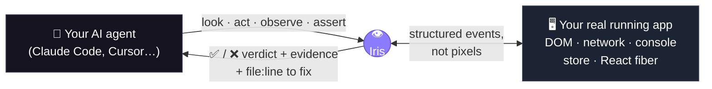

<div align="center">

<picture>
  <source media="(prefers-color-scheme: dark)" srcset="assets/readme/lockup-on-dark.png" />
  
</picture>

### Your AI agent writes the code. **Iris tells it whether the code actually works** — with evidence, not screenshots.

<a href="https://syrin.ai/iris"></a>

[](https://www.npmjs.com/package/@syrin/iris)
[](https://www.npmjs.com/package/@syrin/iris)
[](LICENSE)
[](https://www.npmjs.com/package/@syrin/iris)

**Iris gives your coding agent a verdict, not just a view.** The moment it finishes a change, Iris checks — from **inside your real running app** — that the right things actually happened: the API call returned `200`, the modal opened, the route changed, the store updated, **no console error slipped in**. If something silently broke, it says **what**, **why**, and (on React) the exact **`file:line`** to fix.

`TypeScript` · `Model Context Protocol` · `React-first` · **dev-only · localhost-only · no telemetry · MIT**

[⚡ Quickstart](#-quickstart--give-it-to-your-agent) · [▶︎ Watch the demo](https://syrin.ai/iris) · [📊 Benchmarks](#-honest-benchmarks) · [🤔 Iris vs Playwright?](#-when-to-use-iris--and-when-to-reach-for-playwright--devtools) · [📚 Docs](docs/getting-started.md)

</div>

---

## ⚡ Quickstart — give it to your agent

You don't set this up. **Your agent does.** Paste one line into Claude Code, Cursor, OpenCode, or any MCP agent:

```text
Follow https://raw.githubusercontent.com/syrin-labs/iris/main/SKILL.md
```

That's the whole install. The skill detects whether Iris is already wired up — runs the **setup wizard** the first time, then **verifies your app** every time after. Prefer to do it yourself? `npx @syrin/iris init` registers the MCP server for every agent you have, or see [the full install matrix ↓](#-install-the-full-options).

---

## 👀 What is this, really?

> Modern coding agents are _"effectively programming with a blindfold on."_ Iris takes the blindfold off — and instead of a blurry screenshot, it hands back a **verdict with evidence.**

<table>
<tr>
<td width="50%" valign="top">

#### 🧑‍🎨 If you "vibe code" (and don't write tests)

Your agent says **"done ✅"**, you open the browser, and… the button does nothing. Every time, _you_ are the QA department.

Iris lets your agent **check its own work** — automatically, on every edit. It catches the broken thing **before you ever see it**, and tells the agent how to fix it. You just keep building.

</td>
<td width="50%" valign="top">

#### 🧪 If you're a testing expert

Iris is an **in-process verification + deterministic regression layer** for agent-built web apps. It asserts **program truth** — store/React state, network cardinality, emitted signals, console — not just the rendered DOM.

Recorded flows **replay with no LLM** → a CI gate that diffs the verdict exactly: **0% flake, ~175 tokens/run.** It complements Playwright; it doesn't replace it.

</td>
</tr>
</table>

---

## 🧠 How it works

Your running app already knows everything that just happened — _in code_. Iris exposes that to your agent over **MCP** as one tight loop:



One call checks many things at once and comes back with **proof** — deterministic (structured events, not a vision model), cheap (any model, no screenshot), and pointed at the code:

```jsonc
// The agent clicked "Pay". Did the right things actually happen? One call, ~33 tokens, no screenshot:
iris_assert({
  predicate: { allOf: [
    { kind: "net",     method: "POST", urlContains: "/api/order", status: 200 },
    { kind: "element", query: { role: "dialog", name: "Order confirmed" }, state: "visible" },
    { kind: "signal",  name: "order:saved" },          // the charge actually committed
    { kind: "console", level: "error", absent: true }  // …and nothing errored
  ]}
})
// → { pass: false,
//     evidence: { net: { status: 500, url: "/api/order" } },
//     failureReason: "POST /api/order returned 500, expected 200",
//     source: { file: "src/checkout/PayButton.tsx", line: 42 } }   ❌ caught before you ever saw it
```

---

## ✅ What Iris catches that a screenshot (or a DOM tool) can't

A screenshot sees pixels. The DOM sees markup. **Iris sees the program** — so it catches the bugs that _look_ fine on screen:

| The bug                                                     | Looks fine on screen? | Iris catches it because it reads…            |
| ----------------------------------------------------------- | --------------------- | -------------------------------------------- |
| Pay button silently returns **500**                         | ✅ looks fine         | the **network** response, tied to the click  |
| A **console error** slipped in, UI still renders            | ✅ looks fine         | the **console** stream since the action      |
| The form fired the request **twice** (double-submit)        | ✅ looks fine         | request **cardinality** (`net { count: 1 }`) |
| The badge shows "12" but the **store** holds 0 (UI lies)    | ✅ looks fine         | the app's **state**, not the rendered number |
| A click corrupted **unrelated** data on another screen      | ✅ looks fine         | a **state invariant** (blast-radius)         |
| The component re-renders **60×/sec** with no visible change | ✅ looks fine         | the **React commit** stream                  |
| "Deploy succeeded" but the deploy actually **failed**       | ✅ looks fine         | the store's **real** status                  |

> Most of these are **impossible** for any out-of-the-browser tool to detect — the truth never reaches the DOM.

---

## 🧰 Turn the test cases you never automated into checks the agent runs on every edit

Every team has acceptance criteria and "I just eyeball it" steps that never became tests. A test case maps almost **1:1** to an Iris check:

| Your test case (plain English)                  | Iris check                                                     |
| ----------------------------------------------- | -------------------------------------------------------------- |
| "Login with valid creds lands on the dashboard" | `net /api/login 200` **and** `element tab "Dashboard" visible` |
| "Deleting an item removes it from the list"     | `element {text, scope: list}` **absent**                       |
| "Submitting shows a success toast"              | `text "Saved" visible`                                         |
| "Paying actually charges the customer"          | `signal "order:saved"` **and** `net /api/charge 200`           |
| "Checkout fires exactly one charge"             | `net /api/charge { count: 1 }`                                 |
| "No console errors on checkout"                 | `console level:error absent`                                   |

Record a flow once; Iris **replays it deterministically on every edit** — your CI Playwright suite still gates releases, but Iris is the checklist your agent runs _while it codes_, including the long tail nobody ever automated.

---

## 📊 Honest benchmarks

> We'd rather you hear the caveats from us than catch us hiding them. Every number below is produced by a committed harness — full detail and the cases where **we lose** in [`bench/SCORECARD.md`](bench/SCORECARD.md).

**1 · Cheap enough to run on every edit.** Iris asks narrow questions instead of dumping the whole page:

| Per verify step                                        |   Tokens |
| ------------------------------------------------------ | -------: |
| Full accessibility-tree snapshot (e.g. Playwright MCP) |   ~7,300 |
| **Iris verify loop** (query + observe + assert)        | **~100** |

→ a 20-step flow costs **~2,000 tokens with Iris vs ~146,000** with full-tree snapshots. _(Honest version: force Iris to dump the whole tree too and the gap is only ~1.8× — the 73× is from **not needing** the whole tree. [Full math →](docs/token-efficiency.md))_

**2 · The real moat — re-running a regression suite.** A test's job is the _same_ check, every commit. Iris replays with **no model**; a screenshot/DOM agent must re-drive the whole flow with the LLM every run:

| Re-verify a known flow                  |              Cost / run |   Flake |           vs Iris |
| --------------------------------------- | ----------------------: | ------: | ----------------: |
| **Iris deterministic replay**           |            **~175 tok** |  **0%** |                 — |
| Playwright/DevTools (LLM re-drive)      |             ~30,000 tok | sampled | **128–184× more** |
| **A 4-flow suite** (`iris_flow_verify`) | **~47 tok (flat in K)** |  **0%** |        **2,574×** |

**3 · Caught the most, in a real agent loop.** A live `gpt-4o` tool-use loop over 5 broken-app scenarios (authoritative usage tokens, [Layer B](bench/LAYER-B.md)):

|                     | Bugs caught |               |
| ------------------- | :---------: | ------------- |
| **Iris**            |  **5 / 5**  | most accurate |
| Playwright MCP      |    4 / 5    |               |
| Chrome DevTools MCP |    3 / 5    |               |

### …and where Iris does **not** win (use the right tool)

Being inside the page costs real browser-level fidelity. These are genuine competitor strengths:

- **Pixel/paint regressions** (fonts, paint order, GPU) → a **screenshot** is ground truth. _Measured: a CSS filter that re-tinted 2.3% of pixels — a screenshot caught it; Iris's always-on read (computed style, not pixels) missed it._
- **Trusted native input**, **cross-browser** (WebKit/Firefox), **multi-tab / network mocking** → **Playwright**.
- **A site you don't own / can't add a dependency to** → Iris must embed a dev-only SDK; **Playwright/DevTools** test anything.
- **Visual / computed-style / theme bugs** → **parity** — any tool with a JS `evaluate` reads computed style; Iris is just more ergonomic.

---

## 🤔 When to use Iris — and when to reach for Playwright / DevTools

| You are…                                                            | Reach for                         | Because                                                                       |
| ------------------------------------------------------------------- | --------------------------------- | ----------------------------------------------------------------------------- |
| an **agent building a React/Next app you own**, verifying each edit | **Iris**                          | in-loop, ~100 tok/check, sees state + `file:line`, refuses destructive clicks |
| running a **regression suite on every commit / in CI**              | **Iris**                          | deterministic replay: 0% flake, 128–2574× cheaper than re-driving with an LLM |
| chasing a bug whose truth is **in state, not the DOM**              | **Iris**                          | desync, double-submit, side-effects, silent errors — no DOM tool sees these   |
| testing a **third-party site** / **many browsers** / **real input** | **Playwright**                    | Iris can't instrument code you don't ship, or drive other engines             |
| verifying **true pixels** (visual regression)                       | **Playwright** (or Iris _driven_) | a screenshot is the rendered frame; Iris's always-on read is computed-style   |
| debugging **protocol-level** network/perf on any site               | **DevTools**                      | DevTools MCP speaks raw CDP                                                   |

> **Rule of thumb:** own the app + an agent is building it → Iris is your cheap, deterministic, state-aware inner loop. Driving someone else's site, many engines, or true pixels → Playwright/DevTools. **Plenty of teams use both.**

---

## 📦 Install — the full options

<details open>
<summary><b>Easiest — paste one prompt</b> (recommended)</summary>

```text
Follow https://raw.githubusercontent.com/syrin-labs/iris/main/SKILL.md
```

Setup wizard on first run, verification on every run after. Works with any MCP-capable agent.

</details>

<details>
<summary><b>Persistent skill — register once, type <code>/iris</code> forever</b></summary>

**Claude Code**

```bash
curl --create-dirs -o .claude/skills/iris.md \
  https://raw.githubusercontent.com/syrin-labs/iris/main/SKILL.md
```

**OpenCode**

```bash
opencode skill add https://raw.githubusercontent.com/syrin-labs/iris/main/SKILL.md
```

Then type `/iris` — setup on first use, test the app on every use after.

</details>

<details>
<summary><b>Manual — install + wire the MCP server yourself</b></summary>

**1. Install** (one package re-exports the whole graph — SDK, React adapter, source-mapping plugins, spec runner):

```bash
npm i -D @syrin/iris        # or pnpm / yarn / bun
```

**2. Register the MCP server** with your agent — `npx @syrin/iris` _is_ the server:

```jsonc
// Claude Code — .mcp.json
{ "mcpServers": { "iris": { "command": "npx", "args": ["@syrin/iris"] } } }
```

**3. Connect the dev-only SDK** from your app's entry point (the SDK is tree-shaken out of production):

```ts
// main.tsx / your dev entry — dev only
import { iris } from '@syrin/iris';
if (import.meta.env.DEV) iris.connect({ session: 'my-app' });
// React? add `import { install } from "@syrin/iris"; install()` before connect for component → file:line.
```

**4.** Tell your agent to verify. Full walkthrough → [Getting Started](docs/getting-started.md).

</details>

---

## 📚 Learn more

- **[Getting Started](docs/getting-started.md)** — from zero to your first verdict
- **[Full Guide](docs/usage.md)** — every tool, predicate, and the flow DSL
- **[Benchmark scorecard](bench/SCORECARD.md)** — the honest one-page standing across all layers
- **[Why it's ~73× cheaper](docs/token-efficiency.md)** — the reproducible token math
- **[Watch the demo](https://syrin.ai/iris)**

## 🔩 What's inside

A pnpm + turbo monorepo. One umbrella package (`@syrin/iris`) re-exports everything:

| Package                                         | Role                                                                   |
| ----------------------------------------------- | ---------------------------------------------------------------------- |
| `@syrin/iris-protocol`                          | the wire contract (zod schemas, constants)                             |
| `@syrin/iris-browser`                           | the dev-only instrumentation SDK (DOM/network/console/state observers) |
| `@syrin/iris-server`                            | the bridge + MCP server + the `iris` CLI                               |
| `@syrin/iris-react`                             | React adapter — DOM ref → component → source `file:line`               |
| `@syrin/iris-babel-plugin` / `@syrin/iris-next` | stamp source coordinates (React 19 / Next.js)                          |

## 🔒 Status & safety

Iris is **dev-only** and **localhost-only** by design — the SDK is tree-shaken out of production builds, the bridge binds to localhost, and there is **no telemetry**. It observes _your_ app on _your_ machine; nothing leaves it.

## License

[MIT](LICENSE) © Syrin Labs
</content>
