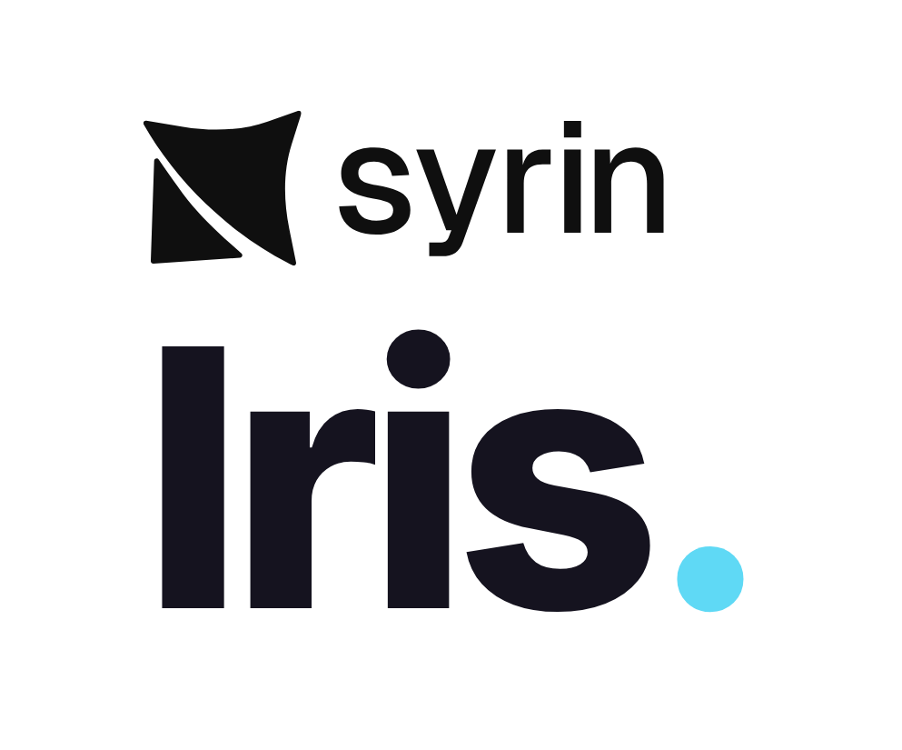
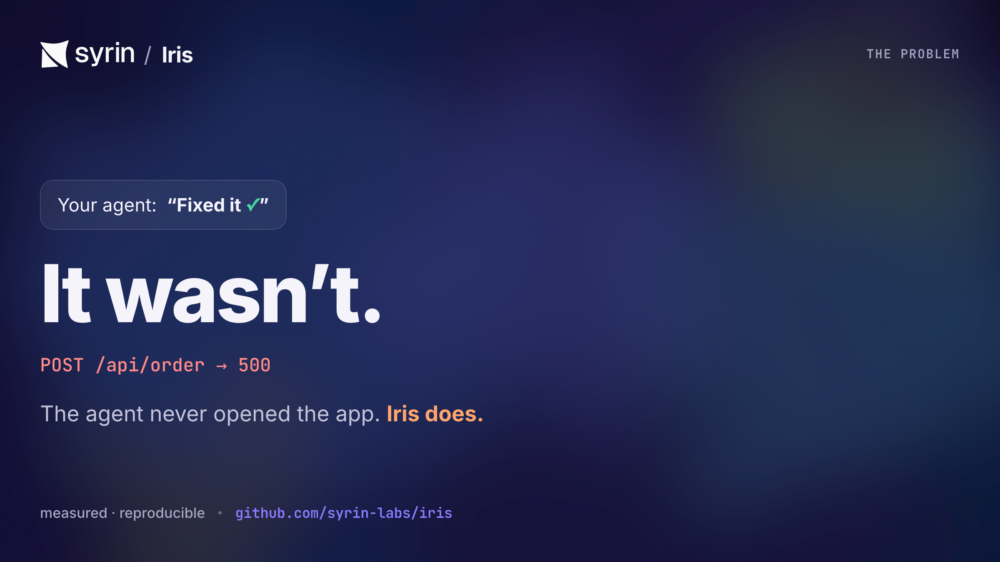
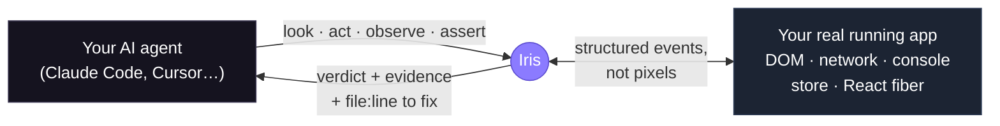
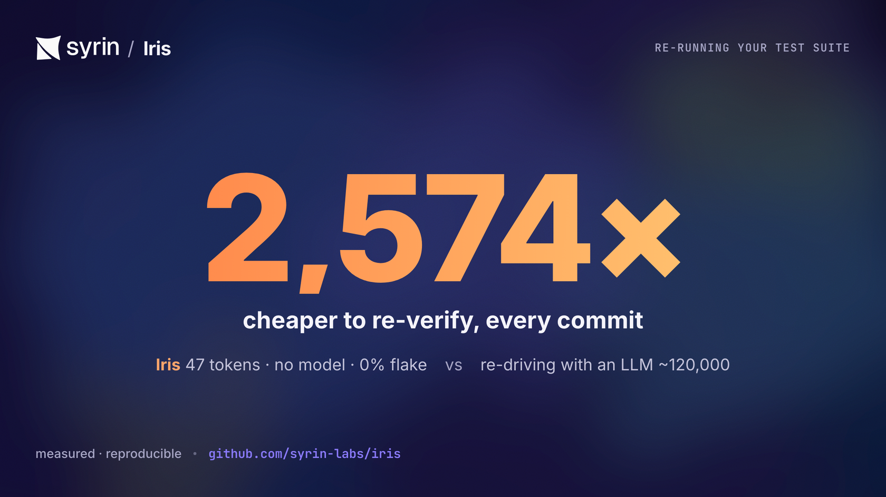
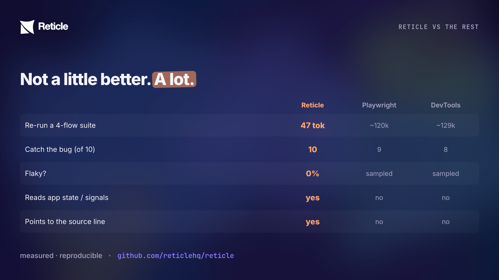

<div align="center">

<picture>
  <source media="(prefers-color-scheme: dark)" srcset="assets/readme/lockup-on-dark.png" />
  
</picture>

### Your AI agent says _"Fixed it."_ It never opened the app.

<a href="https://syrin.ai/iris"></a>

[](https://www.npmjs.com/package/@syrin/iris)
[](https://www.npmjs.com/package/@syrin/iris)
[](https://github.com/syrin-labs/iris/stargazers)
[](https://github.com/syrin-labs/iris/network/members)
[](LICENSE)
[](https://www.npmjs.com/package/@syrin/iris)

Your agent writes the code, declares victory, and moves on, **without ever opening the running app.** So the broken modal, the silent `500`, and the console error nobody saw all ship anyway, and **you** find out last.

**Iris gives your coding agent eyes.** The instant it finishes a change, Iris verifies your **real running app from the inside** and hands back a **verdict with evidence**, never a screenshot.

**Checks the truth:** API `200`, modal open, route changed, store updated, signal fired.

**Catches the invisible:** a silent `500`, a console error, a double-submit, a UI that lies.

**Points at the fix:** on React, the exact **`file:line`**.

`TypeScript` · `Model Context Protocol` · `React-first` · **dev-only · localhost-only · no telemetry · Apache-2.0 SDK**

[Quickstart](#quickstart-give-it-to-your-agent) · [Watch the demo](https://syrin.ai/iris) · [Benchmarks](#honest-benchmarks) · [Iris vs Playwright](#when-to-use-iris-vs-playwright-and-devtools) · [Docs](docs/getting-started.md)

</div>

---

## Quickstart, give it to your agent

You don't set this up. **Your agent does.** Paste one line into Claude Code, Cursor, OpenCode, or any MCP agent:

```text
Follow https://raw.githubusercontent.com/syrin-labs/iris/main/SKILL.md
```

That's the whole install. The skill detects whether Iris is already wired up, runs the **setup wizard** the first time, then **verifies your app** every time after. Prefer to do it yourself? `npx @syrin/iris init` registers the MCP server for every agent you have, or see [the full install matrix](#install-the-full-options).

---

## What is this, really?

> Modern coding agents are _"effectively programming with a blindfold on."_ Iris takes the blindfold off, and instead of a blurry screenshot, it hands back a **verdict with evidence.**



<table>
<tr>
<td width="50%" valign="top">

#### If you "vibe code" (and don't write tests)

Your agent says **"done"**, you open the browser, and… the button does nothing. Every time, _you_ are the QA department.

Iris lets your agent **check its own work**, automatically, on every edit. It catches the broken thing **before you ever see it**, and tells the agent how to fix it. You just keep building.

</td>
<td width="50%" valign="top">

#### If you're a testing expert

Iris is an **in-process verification + deterministic regression layer** for agent-built web apps. It asserts **program truth** (store/React state, network cardinality, emitted signals, console), not just the rendered DOM.

Recorded flows **replay with no LLM** → a CI gate that diffs the verdict exactly: **0% flake, ~175 tokens/run.** It complements Playwright; it doesn't replace it.

</td>
</tr>
</table>

---

## How it works

Your running app already knows everything that just happened, _in code_. Iris exposes that to your agent over **MCP** as one tight loop:



One call checks many things at once and comes back with **proof**, deterministic (structured events, not a vision model), cheap (any model, no screenshot), and pointed at the code:

```jsonc
// The agent clicked "Pay". Did the right things actually happen? One call, ~33 tokens, no screenshot:
iris_assert({
  predicate: { allOf: [
    { kind: "net",     method: "POST", urlContains: "/api/order", status: 200 },
    { kind: "element", query: { role: "dialog", name: "Order confirmed" }, state: "visible" },
    { kind: "signal",  name: "order:saved" },          // the charge actually committed
    { kind: "console", level: "error", absent: true }  // …and nothing errored
  ]}
})
// → { pass: false,
//     evidence: { net: { status: 500, url: "/api/order" } },
//     failureReason: "POST /api/order returned 500, expected 200",
//     source: { file: "src/checkout/PayButton.tsx", line: 42 } }   caught before you ever saw it
```

---

## What Iris catches that a screenshot (or a DOM tool) can't

A screenshot sees pixels. The DOM sees markup. **Iris sees the program**, so it catches the bugs that _look_ fine on screen:

| The bug                                                     | Looks fine on screen? | Iris catches it because it reads…            |
| ----------------------------------------------------------- | --------------------- | -------------------------------------------- |
| Pay button silently returns **500**                         | Yes                   | the **network** response, tied to the click  |
| A **console error** slipped in, UI still renders            | Yes                   | the **console** stream since the action      |
| The form fired the request **twice** (double-submit)        | Yes                   | request **cardinality** (`net { count: 1 }`) |
| The badge shows "12" but the **store** holds 0 (UI lies)    | Yes                   | the app's **state**, not the rendered number |
| A click corrupted **unrelated** data on another screen      | Yes                   | a **state invariant** (blast-radius)         |
| The component re-renders **60×/sec** with no visible change | Yes                   | the **React commit** stream                  |
| "Deploy succeeded" but the deploy actually **failed**       | Yes                   | the store's **real** status                  |

> Most of these are **impossible** for any out-of-the-browser tool to detect: the truth never reaches the DOM.

---

## Turn the test cases you never automated into checks the agent runs on every edit

Every team has acceptance criteria and "I just eyeball it" steps that never became tests. A test case maps almost **1:1** to an Iris check:

| Your test case (plain English)                  | Iris check                                                     |
| ----------------------------------------------- | -------------------------------------------------------------- |
| "Login with valid creds lands on the dashboard" | `net /api/login 200` **and** `element tab "Dashboard" visible` |
| "Deleting an item removes it from the list"     | `element {text, scope: list}` **absent**                       |
| "Submitting shows a success toast"              | `text "Saved" visible`                                         |
| "Paying actually charges the customer"          | `signal "order:saved"` **and** `net /api/charge 200`           |
| "Checkout fires exactly one charge"             | `net /api/charge { count: 1 }`                                 |
| "No console errors on checkout"                 | `console level:error absent`                                   |

Record a flow once; Iris **replays it deterministically on every edit**. Your CI Playwright suite still gates releases, but Iris is the checklist your agent runs _while it codes_, including the long tail nobody ever automated.

---

## Honest benchmarks

> We tested Iris **two ways, a controlled toy app and a real production app, and published both**, including where we lose. Every number is produced by a committed harness ([`bench/SCORECARD.md`](bench/SCORECARD.md), reproduce with `pnpm bench`). A from-scratch explainer that teaches you to read it: [`docs/benchmarks.md`](docs/benchmarks.md).



**A test suite's real job is the _same_ check, every commit.** Iris records a flow once and replays it deterministically with **no model**; the others re-drive the whole thing with an LLM every run. Re-verifying a 4-flow suite: **~47 tokens vs ~120,000, up to 2,574× cheaper, at 0% flake.** That gap _grows_ with your suite size.

### One honest test, two apps


**1 · The toy app (controlled).** 10 injected regressions on the demo. Iris caught **all 10** (detection **1.00**, zero false alarms) at the lowest qualifying cost, **Verification Efficiency 12.27** vs DevTools **10.55** vs Playwright **6.97**. The competitors are cheaper per look _only because they catch less_.

**2 · The real app (our own [Syrin](https://syrin.ai) dashboard, React 19, auth, live data).** With the SDK auto-injected, Iris observed the authenticated dashboard the cheapest, **and gave a verdict the others structurally can't:**


**3 · The kicker: a real bug, caught live.** Before we instrumented anything, Iris's first pass flagged two live **`500`s the UI completely hid** (`GET /projects` and `/recovery/incidents`, a missing `deleted_at` migration).

The page looked perfect. A screenshot would have called it _"done."_ **That is the entire point of Iris.**

### Iris vs the rest, at a glance



### What each tool can actually do


**The moat, re-running a regression suite.** A test's job is the _same_ check, every commit. Iris replays with **no model**; a screenshot/DOM agent must re-drive the whole flow with the LLM every run:

| Re-verify a known flow                  |              Cost / run |   Flake |           vs Iris |
| --------------------------------------- | ----------------------: | ------: | ----------------: |
| **Iris deterministic replay**           |            **~175 tok** |  **0%** |                 , |
| Playwright/DevTools (LLM re-drive)      |             ~30,000 tok | sampled | **128–184× more** |
| **A 4-flow suite** (`iris_flow_verify`) | **~47 tok (flat in K)** |  **0%** |        **2,574×** |

### …and where Iris does **not** win (use the right tool)

Being inside the page costs real browser-level fidelity. These are genuine competitor strengths:

- **Pixel/paint regressions** (fonts, paint order, GPU) → a **screenshot** is ground truth. _Measured: a CSS filter that re-tinted 2.3% of pixels, a screenshot caught it; Iris's always-on read (computed style, not pixels) missed it._
- **Trusted native input**, **cross-browser** (WebKit/Firefox), **multi-tab / network mocking** → **Playwright**.
- **A site you don't own / can't add a dependency to** → Iris must embed a dev-only SDK; **Playwright/DevTools** test anything.
- **Visual / computed-style / theme bugs** → **parity**, any tool with a JS `evaluate` reads computed style; Iris is just more ergonomic.

---

## When to use Iris vs Playwright and DevTools

| You are…                                                            | Reach for                         | Because                                                                       |
| ------------------------------------------------------------------- | --------------------------------- | ----------------------------------------------------------------------------- |
| an **agent building a React/Next app you own**, verifying each edit | **Iris**                          | in-loop, ~100 tok/check, sees state + `file:line`, refuses destructive clicks |
| running a **regression suite on every commit / in CI**              | **Iris**                          | deterministic replay: 0% flake, 128–2574× cheaper than re-driving with an LLM |
| chasing a bug whose truth is **in state, not the DOM**              | **Iris**                          | desync, double-submit, side-effects, silent errors, no DOM tool sees these    |
| testing a **third-party site** / **many browsers** / **real input** | **Playwright**                    | Iris can't instrument code you don't ship, or drive other engines             |
| verifying **true pixels** (visual regression)                       | **Playwright** (or Iris _driven_) | a screenshot is the rendered frame; Iris's always-on read is computed-style   |
| debugging **protocol-level** network/perf on any site               | **DevTools**                      | DevTools MCP speaks raw CDP                                                   |

> **Rule of thumb:** own the app + an agent is building it → Iris is your cheap, deterministic, state-aware inner loop. Driving someone else's site, many engines, or true pixels → Playwright/DevTools. **Plenty of teams use both.**

---

## Install, the full options

<details open>
<summary><b>Easiest, paste one prompt</b> (recommended)</summary>

```text
Follow https://raw.githubusercontent.com/syrin-labs/iris/main/SKILL.md
```

Setup wizard on first run, verification on every run after. Works with any MCP-capable agent.

</details>

<details>
<summary><b>Persistent skill, register once, type <code>/iris</code> forever</b></summary>

**Claude Code**

```bash
curl --create-dirs -o .claude/skills/iris.md \
  https://raw.githubusercontent.com/syrin-labs/iris/main/SKILL.md
```

**OpenCode**

```bash
opencode skill add https://raw.githubusercontent.com/syrin-labs/iris/main/SKILL.md
```

Then type `/iris`, setup on first use, test the app on every use after.

</details>

<details>
<summary><b>Manual, install + wire the MCP server yourself</b></summary>

**1. Install** (one package re-exports the whole graph, SDK, React adapter, source-mapping plugins, spec runner):

```bash
npm i -D @syrin/iris        # or pnpm / yarn / bun
```

**2. Register the MCP server** with your agent, `npx @syrin/iris` _is_ the server:

```jsonc
// Claude Code, .mcp.json
{ "mcpServers": { "iris": { "command": "npx", "args": ["@syrin/iris"] } } }
```

**3. Connect the dev-only SDK** from your app's entry point (the SDK is tree-shaken out of production):

```ts
// main.tsx / your dev entry, dev only
import { iris } from '@syrin/iris';
if (import.meta.env.DEV) iris.connect({ session: 'my-app' });
// React? add `import { install } from "@syrin/iris"; install()` before connect for component → file:line.
```

**4.** Tell your agent to verify. Full walkthrough → [Getting Started](docs/getting-started.md).

</details>

---

## Learn more

- **[Getting Started](docs/getting-started.md)**, from zero to your first verdict
- **[Full Guide](docs/usage.md)**, every tool, predicate, and the flow DSL
- **[Benchmark scorecard](bench/SCORECARD.md)**, the honest one-page standing across all layers
- **[Why it's ~73× cheaper](docs/token-efficiency.md)**, the reproducible token math
- **[Watch the demo](https://syrin.ai/iris)**

## What's inside

A pnpm + turbo monorepo. One umbrella package (`@syrin/iris`) re-exports everything:

| Package                                         | Role                                                                   |
| ----------------------------------------------- | ---------------------------------------------------------------------- |
| `@syrin/iris-protocol`                          | the wire contract (zod schemas, constants)                             |
| `@syrin/iris-browser`                           | the dev-only instrumentation SDK (DOM/network/console/state observers) |
| `@syrin/iris-server`                            | the bridge + MCP server + the `iris` CLI                               |
| `@syrin/iris-react`                             | React adapter, DOM ref → component → source `file:line`                |
| `@syrin/iris-babel-plugin` / `@syrin/iris-next` | stamp source coordinates (React 19 / Next.js)                          |

## Status & safety

Iris is **dev-only** and **localhost-only** by design, the SDK is tree-shaken out of production builds, the bridge binds to localhost, and there is **no telemetry**. It observes _your_ app on _your_ machine; nothing leaves it.

## Community

<div align="center">

Iris is built in the open, for the long run, not as a weekend project. If it earns a place in your workflow, a star helps other developers find it, and everyone who stars, forks, or contributes is credited right here.

<a href="https://star-history.com/#syrin-labs/iris&Date"></a>

**Contributors** thank you for every PR.

<a href="https://github.com/syrin-labs/iris/graphs/contributors"></a>

**Stargazers** thank you for the signal of support.

<a href="https://github.com/syrin-labs/iris/stargazers"></a>

**Forks** thank you for building on Iris.

<a href="https://github.com/syrin-labs/iris/network/members"></a>

</div>

New here? Open an issue, pick one up, or send a PR. See [CONTRIBUTING.md](CONTRIBUTING.md).

## License

Iris uses a per-package license model so it is safe to embed in your own app and fair to build a business on. Each package's `LICENSE` file is authoritative; see the root [LICENSE](LICENSE) for the full breakdown.

- **Embedded in your app, Apache-2.0.** `@syrin/iris-browser`, `-protocol`, `-react`, `-babel-plugin`, `-next`, `-vite-plugin`, `-eslint-plugin` run inside / compile into your application. Use them anywhere, including in the apps you ship to your own customers. No copyleft; explicit patent grant.
- **Server / CLI / MCP, FSL-1.1-ALv2.** `@syrin/iris-server` (and `@syrin/iris-test`, the `@syrin/iris` umbrella) are free for any use except offering Iris itself as a competing hosted service; each release converts to Apache-2.0 after two years.
- **Enterprise features, the Iris Enterprise License.** Source-available under `packages/server/src/ee/`; free for development and evaluation, a subscription license key is required in production.

OEM, embedding, or commercial licensing questions: **hey@syrin.ai**

© 2026 Syrin Labs
</content>
