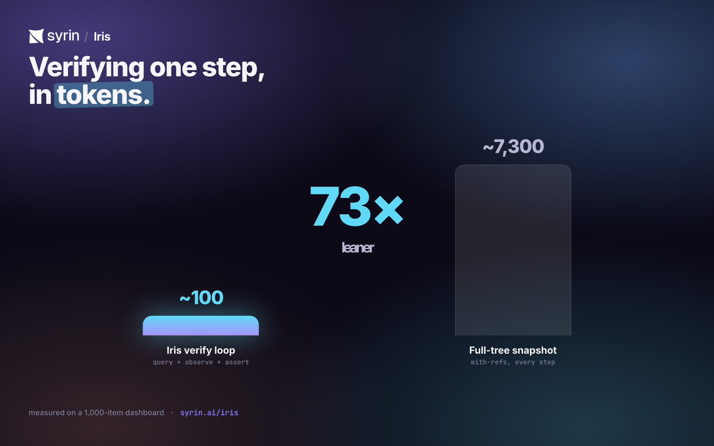
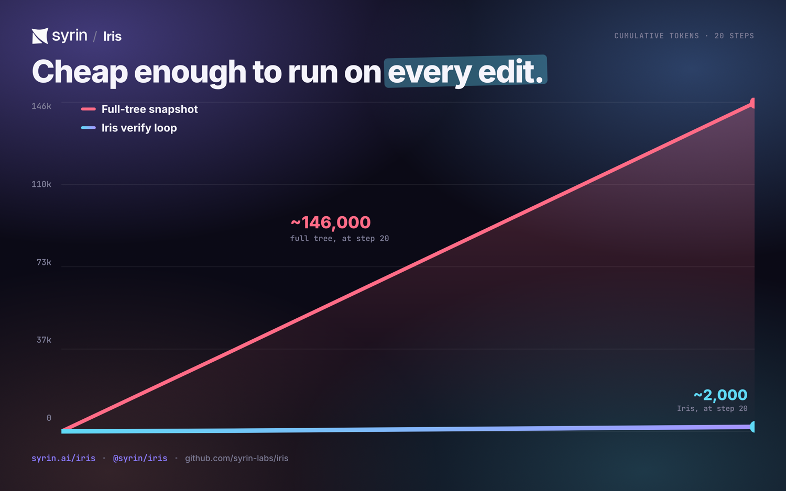
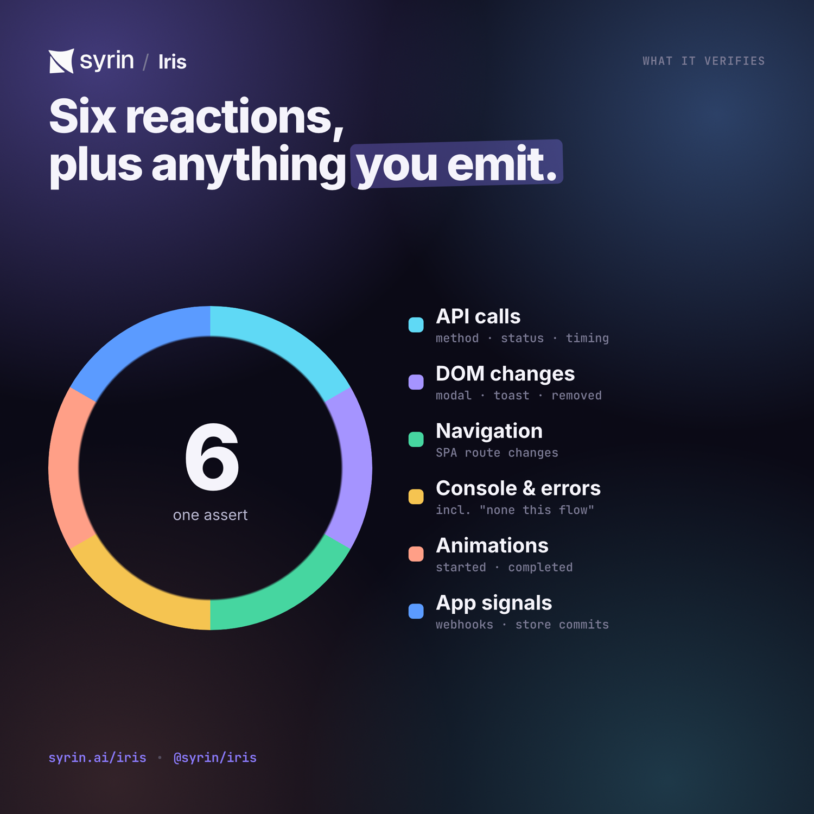
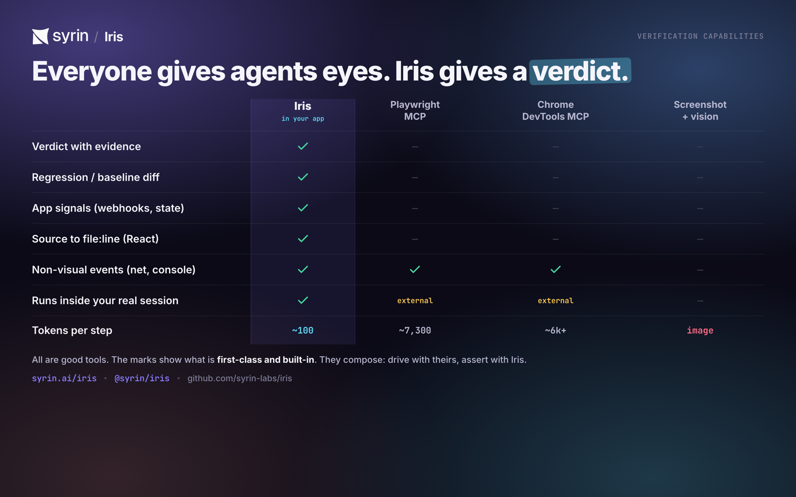

<div align="center">

<picture>
  <source media="(prefers-color-scheme: dark)" srcset="assets/readme/lockup-on-dark.png" />
  
</picture>

### Your AI writes the code. Iris tells it whether the code actually works — with evidence, not screenshots.

<a href="https://syrin.ai/iris"></a>

[](https://www.npmjs.com/package/@syrin/iris)
[](https://www.npmjs.com/package/@syrin/iris)
[](LICENSE)
[](https://www.npmjs.com/package/@syrin/iris)

Iris gives your coding agent a **verdict, not just a view**. The moment your agent finishes a change,
Iris verifies — from **inside your real running app** — that the right things actually happened: the API
call fired with a `200`, the modal opened, the route changed, **no console error slipped in**, the webhook
arrived. If something silently broke, Iris says **what**, **why**, and (on React) the **file:line** to fix.

**TypeScript · Model Context Protocol · React-first · dev-only · localhost-only · MIT**

[Installation](#installation) · [Watch the demo](https://syrin.ai/iris) · [Getting Started](docs/getting-started.md) · [Full Guide](docs/usage.md) · [Why it's ~73× cheaper](docs/token-efficiency.md) · [How is this different?](#how-is-this-different)

</div>

---

## Installation

### Easiest — paste one prompt into your AI tool

One skill file handles everything. First time in a project it runs setup. Every time after that it tests the app.

**Paste this into your AI tool:**

```text
Follow https://raw.githubusercontent.com/syrinlabs/iris/main/SKILL.md
```

That's it. The agent detects whether Iris is already set up (checks for `.iris.json`), and does the right thing — setup wizard on first run, verification on every run after.

---

### Persistent skill — register once, type `/iris` forever

**Claude Code**

```bash
curl --create-dirs -o .claude/skills/iris.md \
  https://raw.githubusercontent.com/syrinlabs/iris/main/SKILL.md
```

**OpenCode**

```bash
opencode skill add https://raw.githubusercontent.com/syrinlabs/iris/main/SKILL.md
```

Then type `/iris` — setup on first use, test the app on every use after.

---

### Manual — four steps

**1. Install**

```bash
npm i -D @syrin/iris       # or pnpm / yarn / bun
```

**2. Configure your MCP server**

Each tool has its own config file and format — pick the one you use:

<details>
<summary><b>Claude Code</b> — <code>.mcp.json</code></summary>

```jsonc
{
  "mcpServers": {
    "iris": {
      "command": "npx",
      "args": ["@syrin/iris", "mcp", "--drive", "http://localhost:4310"],
    },
  },
}
```

</details>

<details>
<summary><b>OpenCode</b> — <code>opencode.json</code></summary>

```jsonc
{
  "mcp": {
    "iris": {
      "type": "local",
      "command": ["npx", "@syrin/iris", "mcp", "--drive", "http://localhost:4310"],
    },
  },
}
```

`type: "local"` is required. `command` is a flat array — no separate `args`.

</details>

<details>
<summary><b>Codex CLI</b> — <code>.codex/config.toml</code></summary>

```toml
[mcp_servers.iris]
command = "npx"
args    = ["@syrin/iris", "mcp", "--drive", "http://localhost:4310"]
```

</details>

<details>
<summary><b>Cursor</b> — <code>.cursor/mcp.json</code></summary>

```jsonc
{
  "mcpServers": {
    "iris": {
      "command": "npx",
      "args": ["@syrin/iris", "mcp", "--drive", "http://localhost:4310"],
    },
  },
}
```

</details>

<details>
<summary><b>Windsurf</b> — <code>~/.codeium/windsurf/mcp_config.json</code></summary>

```jsonc
{
  "mcpServers": {
    "iris": {
      "command": "npx",
      "args": ["@syrin/iris", "mcp", "--drive", "http://localhost:4310"],
    },
  },
}
```

This file is global. Create it if it doesn't exist — Windsurf won't create it automatically.

</details>

<details>
<summary><b>VS Code / GitHub Copilot</b> — <code>.vscode/mcp.json</code></summary>

```jsonc
{
  "servers": {
    "iris": {
      "command": "npx",
      "args": ["@syrin/iris", "mcp", "--drive", "http://localhost:4310"],
    },
  },
}
```

Root key is `"servers"` — not `"mcpServers"`. MCP tools only appear in Copilot **Agent mode**.

</details>

<details>
<summary><b>Zed</b> — <code>~/.config/zed/settings.json</code></summary>

```jsonc
{
  "context_servers": {
    "iris": {
      "command": "npx",
      "args": ["@syrin/iris", "mcp", "--drive", "http://localhost:4310"],
    },
  },
}
```

</details>

Replace `4310` with the port your dev server runs on, or pick a dedicated Iris testing port
(see the skill file for port conflict guidance).

**3. Embed the SDK in your app (dev only)**

```ts
import { iris } from '@syrin/iris';
if (import.meta.env.DEV) iris.connect({ session: 'my-app' });
```

**4. Run your app and ask your agent to verify something**

```
Add a logout button and verify it actually works with Iris.
```

→ See [Getting Started](docs/getting-started.md) for the full walkthrough (React adapter, source mapping, signals).

---

## The problem: your agent has hands, but no eyes

You ask your AI agent to build a feature. It edits the files, says _"done ✅"_ — and then **you** open the
browser, click around, and find out it isn't. Every. Single. Time. The agent can't really check its own
work, so you become its QA department.

- **It can't tell "compiles" from "works."** The code type-checks and the page renders, so the agent
  declares victory — while the Pay button silently `500`s and the console is full of errors.
- **Screenshots are bad eyes.** A full-page shot runs **~1,500+ tokens** through a vision model, is slow
  and non-deterministic — and **blind to everything non-visual**: the failed request, the
  console error, the route that didn't change, the webhook that never came.
- **It ships silent regressions.** A plausible-looking change quietly breaks a sibling feature, and
  nobody notices until a user (or your client) does.
- **Manual QA doesn't scale.** Every change means re-clicking the same flows. You are the slowest part
  of your own loop.

> Modern coding agents are _"effectively programming with a blindfold on."_ Iris takes the blindfold off —
> and instead of handing back a blurry photo, it hands back a **verdict with evidence**.

## The idea: your app already knows what happened — let the agent ask

Your running app knows everything that just happened — _in code_. Iris exposes that to your agent over
**MCP** as a tight loop: **look → act → observe → assert.** One call checks many things at once and comes
back with proof:

```jsonc
// The agent clicked "Pay". Did the right things actually happen? One call, ~33 tokens, no screenshot:
iris_assert({
  predicate: { allOf: [
    { kind: "net",     method: "POST", urlContains: "/api/order", status: 200 },
    { kind: "element", query: { role: "dialog", name: "Order confirmed" }, state: "visible" },
    { kind: "signal",  name: "order:saved" },          // the charge actually committed
    { kind: "console", level: "error", absent: true }  // ...and nothing errored
  ]}
})
// → { pass: false, evidence: { net: { status: 500, url: "/api/order" } },
//     failureReason: "POST /api/order returned 500, expected 200",
//     source: { file: "src/checkout/PayButton.tsx", line: 42 } }   ❌ caught before you ever saw it
```

It’s **deterministic** (structured events, not pixels), **cheap** (any model, no vision), and it tells the
agent exactly where to fix the code.

## Turn the test cases you never automated into checks your agent runs on every edit

Every team has a QA checklist, acceptance criteria, and "I just eyeball it" steps that never became
automated tests. **Iris lets your agent run them against the live app while it codes.** A test case maps
almost 1:1 to a check:

| Your test case (plain English)                  | Iris check                                                     |
| ----------------------------------------------- | -------------------------------------------------------------- |
| "Login with valid creds lands on the dashboard" | `net /api/login 200` **and** `element tab "Dashboard" visible` |
| "Deleting an item removes it from the list"     | `element {text, scope: list}` **absent**                       |
| "Submitting shows a success toast"              | `text "Saved" visible`                                         |
| "Paying actually charges the customer"          | `signal "order:saved"` **and** `net /api/charge 200`           |
| "No console errors on checkout"                 | `console level:error absent`                                   |

> Your CI Playwright/Cypress suite gates releases. **Iris is the checklist your agent runs on every
> edit** — including the long tail nobody ever wrote automation for.

## Catch the regressions your agent would silently ship

Snapshot the app's semantic state now; diff it later. _"Did anything quietly go missing?"_ is a tool call,
not a manual hunt:

```jsonc
iris_baseline_save({ name: "dashboard" })   // before the change
// ...agent edits code...
iris_diff({ baseline: "dashboard" })
// → { removed: [ { role: "button", name: "Export" } ], counters: { consoleErrors: +1 } }
//   the agent deleted the Export button and introduced an error — flagged, not shipped.
```

## ~73× fewer tokens than feeding the agent the whole page (and we'll show you the honest math)

Measured on the same dashboard (a 1,000-item list) — [full methodology + caveats](docs/token-efficiency.md):

|                                                        | Tokens per step |
| ------------------------------------------------------ | --------------: |
| Full accessibility-tree snapshot (e.g. Playwright MCP) |          ~7,300 |
| **Iris verify loop** (query + observe + assert)        |        **~100** |

Iris asks _narrow questions_ instead of dumping the whole page every step. A 20-step flow: **~2,000 tokens
with Iris vs ~146,000** with full-tree snapshots — the difference between "too expensive to run" and "run
it on every edit."

> **The honest version** (we'd rather you hear it from us): force Iris to dump the _whole_ tree too and the
> gap is only ~1.8×. The 73× comes from **not needing the whole tree** — that's architectural, not a
> serializer trick. [Read the full breakdown →](docs/token-efficiency.md)

<p align="center">
  
  
</p>

---

---

## A full walkthrough: the bug your agent would have shipped

The clip at the top is this, end to end. You asked your agent to add a **Redeploy** button; it edited the
code and said _"done."_ Here is Iris checking that claim — from inside the running app, no screenshot:

**1. The agent acts, then asks Iris to verify (not screenshot).**

```jsonc
iris_act({ query: { role: "button", name: "Redeploy" } }); // click it
iris_assert({
  predicate: { allOf: [
    { kind: "net",     method: "POST", urlContains: "/api/redeploy", status: 200 },
    { kind: "signal",  name: "deploy:redeployed" },
    { kind: "console", level: "error", absent: true }
  ]}
})
```

**2. Iris returns a verdict with evidence — and it's red:**

```jsonc
{
  "pass": false,
  "evidence": { "net": { "url": "/api/redeploy", "status": 401 } },
  "failureReason": "POST /api/redeploy returned 401, expected 200",
  "source": { "file": "src/lib/api.ts", "line": 65 },
} // ← the exact line to fix
```

The button rendered, the toast said _"Redeploying…"_, a screenshot would have looked perfect — and the
request `401`'d. The agent never saw it. Iris did.

**3. The agent fixes the one line Iris pointed at:**

```diff
- headers: { 'content-type': 'application/json' },
+ headers: { 'content-type': 'application/json', authorization: `Bearer ${token}` },
```

**4. Re-assert → green, with proof:**

```jsonc
{ "pass": true, "evidence": { "net": { "status": 200 }, "signal": "deploy:redeployed" } }
```

~100 tokens, deterministic, no vision model. That's the loop your agent runs on **every** edit.

---

## What it can verify

Six canonical reactions, plus anything your app emits:

- ✅ **API calls** — method, URL, status, timing (`net`)
- ✅ **DOM changes** — element appeared / disappeared, modal/drawer/toast opened
- ✅ **Navigation** — SPA route changes
- ✅ **Console & errors** — including "**no** errors during this flow"
- ✅ **Animations** — started / completed
- ✅ **App signals** — webhooks, websockets, store commits, async jobs you surface via `iris.signal()`
- ✅ **Regressions** — baseline now, diff later ("did anything silently go missing?")
- ✅ **Source mapping** — DOM element → React component → **file:line** to edit

…and an autonomous **crawler** (`iris_crawl`) that clicks every reachable control and classifies what
breaks (console error, failed request, dead control). ~44 MCP tools in total.

<p align="center"></p>

## Why screenshots can't do this — and Iris can: `signals`

The most important question is rarely visible. _"Did the charge actually commit?"_ isn't a pixel. So your
app emits structured facts at the moments that matter:

```ts
iris.signal('order:saved', { id: '123', total: 4999 }); // the store committed
iris.signal('webhook:received', { provider: 'stripe' }); // an external event arrived
```

…and the agent asserts on them directly. A bundled ESLint rule (`require-signal-on-mutation`) flags any
state mutation that forgot to emit one, so your observable surface can't silently drift from your code.

## Cookbook

Common verifications, copy-paste. Each is one `iris_assert` (or a tiny loop) the agent runs right after it acts.

**Did the form actually submit — not just clear?**

```jsonc
iris_assert({ predicate: { allOf: [
  { kind: "net",     method: "POST", urlContains: "/api/contact", status: 200 },
  { kind: "element", query: { text: "Thanks — we'll be in touch" }, state: "visible" }
]}})
```

**Catch a silent 500 hiding behind a success toast:**

```jsonc
iris_assert({ predicate: { allOf: [
  { kind: "element", query: { text: "Saved" }, state: "visible" }, // the toast says it worked
  { kind: "net",     urlContains: "/api/save", status: 200 }        // the network says the truth
]}})
// → pass:false, evidence.net.status:500 — caught before it shipped.
```

**"No console errors during this whole flow":**

```jsonc
const { since } = await iris_act({ query: { role: "button", name: "Checkout" } });
iris_assert({ since, predicate: { kind: "console", level: "error", absent: true } });
```

**Confirm an async job / webhook actually fired** (not just the spinner):

```ts
iris.signal('invoice:emailed', { id }); // emit at the commit point in your app
```

```jsonc
iris_wait_for({ predicate: { kind: "signal", name: "invoice:emailed" }, timeoutMs: 5000 });
```

**Catch a regression before it ships:**

```jsonc
iris_baseline_save({ name: "settings" }); // before the change
// …agent edits…
iris_diff({ baseline: "settings" });      // → { removed: [...], counters: { consoleErrors: +1 } }
```

**Assert a debounced / animated result without flaky sleeps:**

```jsonc
iris_clock({ advanceMs: 400 }); // skip the debounce deterministically
iris_assert({ predicate: { kind: "element", query: { role: "listbox" }, state: "visible" } });
```

> More patterns + the full predicate DSL: **[Usage Guide](docs/usage.md)**.

## How it works

```text
your coding agent ──MCP──▶ iris bridge + server ──WebSocket──▶ @syrin/iris-browser (in your app)
                                   ▲                                    │
                                   └──────────── observations ─────────┘
                          (DOM · network · routes · console · animations · signals)
```

Your app instruments _itself_ with a tiny dev-only SDK (7 observers feeding a 2,000-event / 60s ring
buffer). The bridge relays the agent's MCP tool calls to the page and streams the page's observations back.
Nothing leaves your machine; it's **localhost-only** and **tree-shaken out of production**.

---

## How is this different?

The category is crowded — here's the honest map. The short version: **everyone now gives agents _eyes_;
Iris gives agents a _verdict_.**

|                                          | What it's for                                                                                                                                                                                                      |
| ---------------------------------------- | ------------------------------------------------------------------------------------------------------------------------------------------------------------------------------------------------------------------ |
| **Playwright / Cypress**                 | Scripted E2E tests in CI. Great — but you write and maintain them, and they run separately from your agent.                                                                                                        |
| **Playwright MCP / Chrome DevTools MCP** | Let an agent _drive/inspect_ a separate browser. Powerful — but full-tree snapshots are token-heavy, they leave "did it work?" for the agent to infer, and there's no first-class assert/regression or source-map. |
| **Domscribe / React Grab / LocatorJS**   | Map a DOM element to its source file:line (Iris does this too). But they stop at editing — **no assertions, no regression, no network/console/signal observation.**                                                |
| **Iris**                                 | Lets your agent _verify_ your running app cheaply, from **inside** it (your real session/auth), with **assertions + regression + signals** as first-class — and points at the **source file** to fix.              |

<p align="center"></p>

**They compose:** drive with Playwright MCP, **verify with Iris.**

<details>
<summary><b>“Why not just use Playwright MCP / Chrome DevTools MCP? They’re free and official.”</b></summary>

They’re built to **drive** a browser, not to **verify** an app. They hand your agent a full
accessibility-tree snapshot (~6.8k tokens, up to 50k on big pages) and the agent has to _infer_ whether
things worked; they’re blind to non-visual events (the webhook, the store commit); they spin up a
_separate_ browser; they have no regression/baseline primitive; and they can’t tell the agent _which file_
to fix. Iris runs _inside_ your real app, returns a verdict-with-evidence in ~100 tokens, sees what
screenshots can’t, catches silent regressions, and source-maps to file:line. **Drive with theirs; verify
with Iris.**

</details>

<details>
<summary><b>“Can’t the agent just take a screenshot?”</b></summary>

It can — and it’s the worst option: a full-page screenshot runs ~1,500+ tokens through a vision model,
is non-deterministic, and is blind to everything non-visual. Iris answers those as ~33-token structured
predicates. (Iris _also_ ships `iris_screenshot` / `iris_visual_diff` for the genuinely visual checks.)

</details>

<details>
<summary><b>“How efficient / reliable is it, really?”</b></summary>

~100 tokens for a full verify loop vs ~7,300 for a full-tree snapshot — ~73× on the common loop (honest
caveat: ~1.8× full-tree-vs-full-tree). Deterministic: it reads structured events from a ring buffer with
look-back + await-forward semantics, no vision model involved; `iris_clock` can freeze/advance time for
toasts and debounces. Backed by 95 test files. [Methodology →](docs/token-efficiency.md)

</details>

<details>
<summary><b>“How much work is integration?”</b></summary>

Two lines to start (`iris.connect()` + point your agent at the MCP server); reuse existing testids
immediately. Depth is incremental — add `signals` only at the commit points that matter (a lint rule flags
the ones you miss). Dev-only, tree-shaken out of production.

</details>

## Docs

- **[Installation (skill file + manual)](README.md#installation)** — `/iris-setup` (one-time setup) and `/iris` (test the app) skills for Claude Code, OpenCode, Cursor, Windsurf, VS Code, Codex, and Zed. Manual configs for each tool also in that section.
- **[Getting Started](docs/getting-started.md)** — install, wire up your agent, first verification (step by step).
- **[Integrate with Claude Code](docs/integrate-with-claude-code.md)** — copy-paste prompts to make a coding agent wire Iris in and verify its own work.
- **[Integration Patterns](docs/integration-patterns.md)** — zero-prod-bundle integration + adopting Iris incrementally (testids → capabilities → signals).
- **[Usage Guide](docs/usage.md)** — every tool, the predicate DSL, real situations & use cases, FAQ.
- **[Flows, recorder & self-healing](docs/flows.md)** — record once / run forever: `.iris/` flows anchored on testid+signal, legible drift, `iris_flow_heal`.
- **[Testing with `@syrin/iris-test`](docs/testing.md)** — declarative, signal-bound specs (`irisTest`), headless runs, flows-as-specs, CI.
- **[Human-in-the-loop control](docs/human-control.md)** — pause/steer/end the agent from the floating panel.
- **[Token Efficiency](docs/token-efficiency.md)** — the head-to-head benchmark + honest methodology.
- **[Use it in your own app (no npm publish)](docs/local-install.md)** — local-registry path for testing in a real external app today.

## What's inside

One install (`@syrin/iris`) — everything ships as a subpath:

| Import               | What it is                                                |
| -------------------- | --------------------------------------------------------- |
| `@syrin/iris`        | the dev-only browser SDK + React adapter (embed in app)   |
| `@syrin/iris/server` | the bridge + MCP server — also the `iris` CLI             |
| `@syrin/iris/test`   | the declarative spec runner (`irisTest`)                  |
| `@syrin/iris/next`   | Next.js source mapping (keeps SWC) via `withIris`         |
| `@syrin/iris/babel`  | React 19 source-mapping Babel plugin (`data-iris-source`) |
| `@syrin/iris/eslint` | the `require-signal-on-mutation` lint rule                |

> Internally these are separate workspace packages (`packages/*`), bundled into the one published package at build time.

## Status & safety

Active development (v0.3.x); **dev-only and localhost-only by default**. Observers are additive and fully
reversible — Iris never breaks the host app. No telemetry. MIT licensed. React 18/19 + Next.js today; the
core SDK and `signals` are framework-agnostic (Vue/Svelte adapters on the roadmap).

See [`WELCOME.md`](WELCOME.md) to develop.

## License

MIT © Iris contributors
