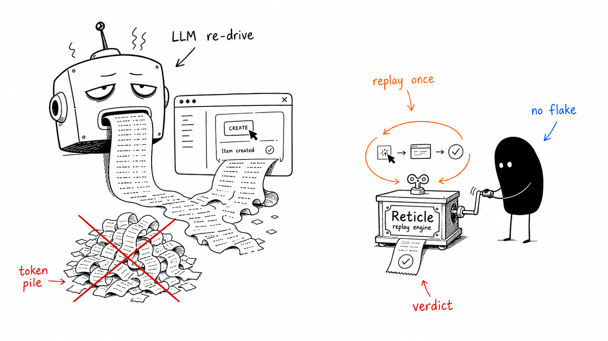
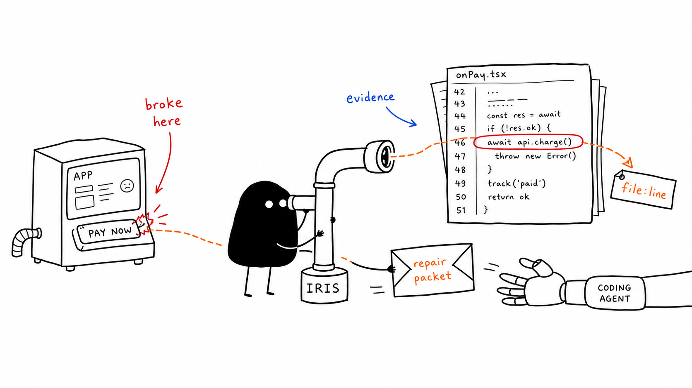
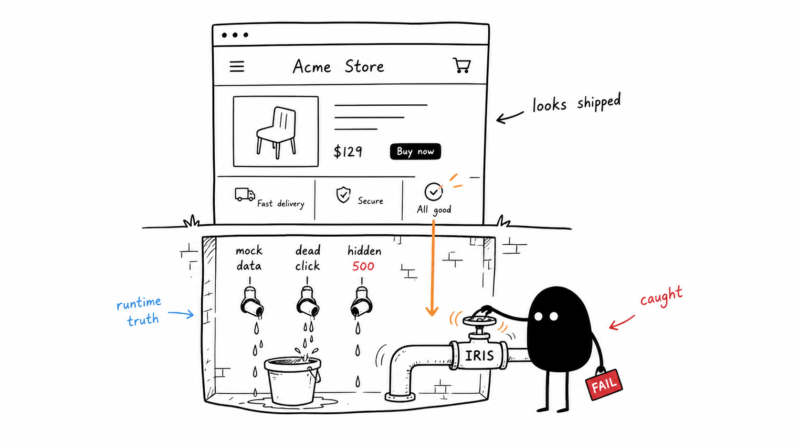
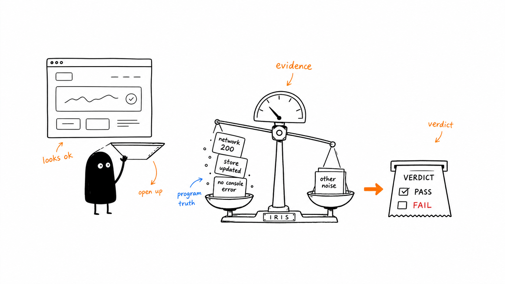
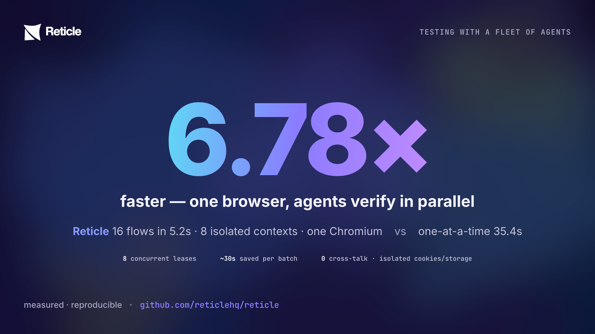

<div align="center">

<picture>
  <source media="(prefers-color-scheme: dark)" srcset="assets/readme/dark-logo.png" />
  
</picture>

# Reticle

### Your Playwright tests are in CI. Your agent never sees them.

**Reticle is the proof layer for AI agents.** It reads the _program_ — network, store state, signals, the React commit stream — not a screenshot, hands back a pass/fail **verdict with the `file:line` to fix**, and catches the silent bugs a screenshot or DOM tool **structurally cannot see.** Measured: **10/10 bugs caught, 0 false positives, 2,574× cheaper to re-run, and two live `500`s caught on our own production app the first time we pointed it at one.**

<a href="https://reticle.ai/reticle"></a>

[](https://www.npmjs.com/package/@reticlehq/core) [](https://www.npmjs.com/package/@reticlehq/core) [](https://github.com/reticlehq/reticle/stargazers) [](https://github.com/reticlehq/reticle/network/members) [](LICENSE) [](https://www.npmjs.com/package/@reticlehq/core)

</div>

---

## The problem, the fix, the numbers

**The gap:** Your agent edits code, infers it worked, and moves on — it doesn't run your Playwright suite between every change. By the time CI catches something, the agent has already moved on and the context is gone. The broken modal, the silent `500`, the wrong store state — your agent shipped it and called it done.

**Reticle closes that gap.** It instruments your running app from the inside and feeds your agent a verdict after every edit, before it moves on. This is the layer your CI suite _can't_ be — inside the agent's loop, while it codes. **Playwright gates releases. Reticle gates edits.**

**What it reads that Playwright can't:** App store state, custom signals, request cardinality — program truth that never reaches the DOM. A page can look perfect on screen while a `500` fires underneath. Playwright sees the page. Reticle sees the program.

<p align="center">
  
</p>

**The numbers — every one measured by a committed harness, reproducible with `pnpm bench`, and we publish where we _lose_ too:**

| Check                                                     | Result           |
| --------------------------------------------------------- | ---------------- |
| Bugs caught (10 injected regressions, controlled app)     | **10 / 10**      |
| False positives                                           | **0**            |
| Cost to re-run a 4-flow regression suite                  | **~47 tokens**   |
| Same suite, LLM re-driven (Playwright/DevTools)           | ~120,000 tokens  |
| **Speed-up**                                              | **2,574×**       |
| Flake rate on deterministic replay                        | **0%**           |
| Real app, first pass: live `500`s the UI hid              | **2 caught**     |
| Parallel agents on **one** browser (16 flows, 8 contexts) | **6.78× faster** |

> **The proof that mattered most:** before we instrumented anything, Reticle's _first_ pass on our own production dashboard flagged two live `500`s — `GET /projects` and `/recovery/incidents` — that the UI completely hid. The page looked perfect. A screenshot would have called it done. **That is the entire point of Reticle**, and we found it on our own app, not a cherry-picked demo.

→ [Full benchmark scorecard](bench/SCORECARD.md) · [Reproducible token math](docs/token-efficiency.md)

---

## Install in 30 seconds

**Easiest — paste one line into your agent:**

```text
Follow https://raw.githubusercontent.com/reticlehq/reticle/main/SKILL.md
```

That's it. The skill auto-detects whether Reticle is already set up, runs the wizard the first time, and verifies your app every time after. Works with Claude Code, Cursor, OpenCode, and any MCP agent.

**Or via CLI:**

```bash
npx @reticlehq/core init
```

Registers the MCP server for every agent you have in one shot. → [More install options](#install-the-full-options)

**Or register the MCP server directly in Claude Code:**

```bash
claude mcp add reticle -s user -- npx @reticlehq/core mcp
```

Then **restart Claude Code** (or run `/mcp` to refresh) so it picks up the server.

---

`TypeScript` · `Model Context Protocol` · `React-first` · **dev-only · localhost-only · no telemetry · Apache-2.0 SDK**

[How it works](#how-it-works) · [How to use it](#how-to-use-it) · [Watch the demo](https://reticle.ai/reticle) · [Full benchmarks](#honest-benchmarks) · [Reticle vs Playwright](#when-to-use-reticle-vs-playwright-and-devtools) · [Docs](docs/getting-started.md)

---

## What is this, really?

> Modern coding agents are _"effectively programming with a blindfold on."_ Reticle takes the blindfold off, and instead of a blurry screenshot, it hands back a **verdict with evidence.**


**In one sentence:** your AI coding agent says _"done"_ without ever opening the app — Reticle makes it open the app, confirm the thing actually works, and prove it, automatically, on every edit.

**The value lands differently depending on who you are — here's yours:**

| You are… | What Reticle does for you |
| --- | --- |
| **Building with AI, don't write tests** ("vibe coding") | Your agent becomes its own QA. It checks its own work on every edit and fixes the break **before you ever see it** — so you stop being the manual tester and just keep building. |
| **A software engineer** | An in-loop verifier: one call asserts over **network, store state, signals, console, and the React render stream**, returns a pass/fail verdict with the exact **`file:line` to fix**, and replays recorded flows deterministically — no LLM, **0% flake, ~175 tokens/run**. |
| **In QA** | Every "I just eyeball it" acceptance step becomes a check the agent runs automatically on every edit — including the long tail nobody ever automated. Same flow, same verdict, every run. **Playwright gates releases; Reticle gates edits.** |
| **A founder / engineering leader** | Fewer broken things shipped, agents that **prove their own work**, **2,574× cheaper** regression runs, and a **fleet of agents that verify in parallel** on one browser. Dev-only, localhost-only, **no telemetry** — nothing leaves your machine. |

---

## How it works

Your running app already knows everything that just happened, _in code_. Reticle exposes that to your agent over **MCP** as one tight loop:


<p align="center">
  
</p>

One call checks many things at once and comes back with **proof**, deterministic (structured events, not a vision model), cheap (any model, no screenshot), and pointed at the code:

```jsonc
// The agent clicked "Pay". Did the right things actually happen? One call, ~33 tokens, no screenshot:
reticle_assert({
  predicate: { allOf: [
    { kind: "net",     method: "POST", urlContains: "/api/order", status: 200 },
    { kind: "element", query: { role: "dialog", name: "Order confirmed" }, state: "visible" },
    { kind: "signal",  name: "order:saved" },          // the charge actually committed
    { kind: "console", level: "error", absent: true }  // …and nothing errored
  ]}
})
// → { pass: false,
//     evidence: { net: { status: 500, url: "/api/order" } },
//     failureReason: "POST /api/order returned 500, expected 200",
//     source: { file: "src/checkout/PayButton.tsx", line: 42 } }   caught before you ever saw it
```

<p align="center">
  
</p>

---

## How to use it

Three steps, then it runs itself:

**1 · Add Reticle to your app once.** One plugin line + a dev-only `reticle.connect()` (the SDK is tree-shaken out of production builds). Don't want to do it by hand? Paste one line to your agent and it wires everything for you:

```text
Follow https://raw.githubusercontent.com/reticlehq/reticle/main/SKILL.md
```

**2 · Ask your agent in plain English.** No test syntax to learn — you describe the outcome, the agent drives your _real_ running app through Reticle and hands back proof:

> **You:** "Verify login works — it should call `/api/login`, land on the dashboard, and set the signed-in user."
>
> **Agent, via Reticle:** clicks **Sign in** → `POST /api/login → 200 (14 ms)` → dashboard rendered → store now holds `auth: { email: "admin@…" }` **✅ PASS** — with that evidence attached. Had it failed, you'd get the failing check **and the `file:line` to fix** instead of a guess.

**3 · Record the flow once; it replays free, forever.** Save that journey as a flow and Reticle re-runs it deterministically on every later edit — **no model, 0% flake, ~47 tokens for a whole suite.** That's your regression net, running _inside_ the agent's loop instead of waiting for CI.

→ Full walkthrough: **[Getting Started](docs/getting-started.md)** · every tool & predicate: **[Usage guide](docs/usage.md)**

---

## What Reticle catches that a screenshot (or a DOM tool) can't

A screenshot sees pixels. The DOM sees markup. **Reticle sees the program**, so it catches the bugs that _look_ fine on screen:

| The bug | Looks fine on screen? | Reticle catches it because it reads… |
| --- | --- | --- |
| Pay button silently returns **500** | Yes | the **network** response, tied to the click |
| A **console error** slipped in, UI still renders | Yes | the **console** stream since the action |
| The form fired the request **twice** (double-submit) | Yes | request **cardinality** (`net { count: 1 }`) |
| The badge shows "12" but the **store** holds 0 (UI lies) | Yes | the app's **state**, not the rendered number |
| A click corrupted **unrelated** data on another screen | Yes | a **state invariant** (blast-radius) |
| The component re-renders **60×/sec** with no visible change | Yes | the **React commit** stream |
| "Deploy succeeded" but the deploy actually **failed** | Yes | the store's **real** status |

> Most of these are **impossible** for any out-of-the-browser tool to detect: the truth never reaches the DOM.

---

## Turn the test cases you never automated into checks the agent runs on every edit

Every team has acceptance criteria and "I just eyeball it" steps that never became tests. A test case maps almost **1:1** to an Reticle check:

| Your test case (plain English) | Reticle check |
| --- | --- |
| "Login with valid creds lands on the dashboard" | `net /api/login 200` **and** `element tab "Dashboard" visible` |
| "Deleting an item removes it from the list" | `element {text, scope: list}` **absent** |
| "Submitting shows a success toast" | `text "Saved" visible` |
| "Paying actually charges the customer" | `signal "order:saved"` **and** `net /api/charge 200` |
| "Checkout fires exactly one charge" | `net /api/charge { count: 1 }` |
| "No console errors on checkout" | `console level:error absent` |

Record a flow once; Reticle **replays it deterministically on every edit**. Your CI Playwright suite still gates releases, but Reticle is the checklist your agent runs _while it codes_, including the long tail nobody ever automated.

---

## Honest benchmarks

> We tested Reticle **two ways, a controlled toy app and a real production app, and published both**, including where we lose. Every number is produced by a committed harness ([`bench/SCORECARD.md`](bench/SCORECARD.md), reproduce with `pnpm bench`). A from-scratch explainer that teaches you to read it: [`docs/benchmarks.md`](docs/benchmarks.md).

<p align="center">
  
</p>


**A test suite's real job is the _same_ check, every commit.** Reticle records a flow once and replays it deterministically with **no model**; the others re-drive the whole thing with an LLM every run. Re-verifying a 4-flow suite: **~47 tokens vs ~120,000, up to 2,574× cheaper, at 0% flake.** That gap _grows_ with your suite size.

### One honest test, two apps


**1 · The toy app (controlled).** 10 injected regressions on the demo. Reticle caught **all 10** (detection **1.00**, zero false alarms) at the lowest qualifying cost, **Verification Efficiency 12.27** vs **Chrome DevTools MCP 10.55** vs **Playwright MCP 6.97**. The competitors are cheaper per look _only because they catch less_.

**2 · The real app (our own [Reticle](https://reticle.ai) dashboard, React 19, auth, live data).** With the SDK auto-injected, Reticle observed the authenticated dashboard the cheapest, **and gave a verdict the others structurally can't:**


**3 · The kicker: a real bug, caught live.** Before we instrumented anything, Reticle's first pass flagged two live **`500`s the UI completely hid** (`GET /projects` and `/recovery/incidents`, a missing `deleted_at` migration).

The page looked perfect. A screenshot would have called it _"done."_ **That is the entire point of Reticle.**

### Reticle vs the rest, at a glance


### What each tool can actually do


**The moat, re-running a regression suite.** A test's job is the _same_ check, every commit. Reticle replays with **no model**; a screenshot/DOM agent must re-drive the whole flow with the LLM every run:

| Re-verify a known flow | Cost / run | Flake | vs Reticle |
| --- | --: | --: | --: |
| **Reticle deterministic replay** | **~175 tok** | **0%** | , |
| Playwright/DevTools (LLM re-drive) | ~30,000 tok | sampled | **128–184× more** |
| **A 4-flow suite** (`reticle_flow_verify`) | **~47 tok (flat in K)** | **0%** | **2,574×** |

### …and where Reticle does **not** win (use the right tool)

Being inside the page costs real browser-level fidelity. These are genuine competitor strengths:

- **Pixel/paint regressions** (fonts, paint order, GPU) → a **screenshot** is ground truth. _Measured: a CSS filter that re-tinted 2.3% of pixels, a screenshot caught it; Reticle's always-on read (computed style, not pixels) missed it._
- **Trusted native input**, **cross-browser** (WebKit/Firefox), **multi-tab / network mocking** → **Playwright**.
- **A site you don't own / can't add a dependency to** → Reticle must embed a dev-only SDK; **Playwright/DevTools** test anything.
- **Visual / computed-style / theme bugs** → **parity**, any tool with a JS `evaluate` reads computed style; Reticle is just more ergonomic.

---

## One browser, a whole fleet of agents

Running a swarm of agents — or a parallel test suite — against the same app? Reticle does **not** launch a browser per agent. The daemon keeps **one** headless Chromium and leases each agent its own **isolated context** (separate cookies, storage, and DOM), so a fleet verifies in parallel with no cross-talk and no per-agent browser startup.



**Measured:** 16 verification flows across **8 concurrent leased contexts** finish in **5.2s** vs **35.4s** one-at-a-time — **6.78× faster, ~30s saved per batch**, with all 8 contexts live at peak. The pool queues work above the cap (default `min(8, cores − 1)`) and automatically reclaims a lease from any hung or crashed agent, so a fleet of agents stays bounded and fair — one dead agent never starves the rest.

Two MCP tools drive it: **`reticle_lease_acquire`** (open a fresh isolated context, get back a `sessionId`) and **`reticle_lease_release`** (close it, free the slot); **`reticle_sessions`** shows which sessions are pool-leased vs. human tabs, grouped by app. → [Multi-agent testing guide](docs/multi-agent-testing.md)

---

## When to use Reticle vs Playwright and DevTools

| You are… | Reach for | Because |
| --- | --- | --- |
| an **agent building a React/Next app you own**, verifying each edit | **Reticle** | in-loop, ~100 tok/check, sees state + `file:line`, refuses destructive clicks |
| running a **regression suite on every commit / in CI** | **Reticle** | deterministic replay: 0% flake, 128–2574× cheaper than re-driving with an LLM |
| running **many agents** (or a parallel suite) against the app you own | **Reticle** | one browser, an isolated context per agent — 6.78× faster than a browser each, no cross-talk |
| chasing a bug whose truth is **in state, not the DOM** | **Reticle** | desync, double-submit, side-effects, silent errors, no DOM tool sees these |
| testing a **third-party site** / **many browsers** / **real input** | **Playwright** | Reticle can't instrument code you don't ship, or drive other engines |
| verifying **true pixels** (visual regression) | **Playwright** (or Reticle _driven_) | a screenshot is the rendered frame; Reticle's always-on read is computed-style |
| debugging **protocol-level** network/perf on any site | **DevTools** | DevTools MCP speaks raw CDP |

> **Rule of thumb:** own the app + an agent is building it → Reticle is your cheap, deterministic, state-aware inner loop. Driving someone else's site, many engines, or true pixels → Playwright/DevTools. **Plenty of teams use both.**

---

## Install, the full options

<details open>
<summary><b>Easiest, paste one prompt</b> (recommended)</summary>

```text
Follow https://raw.githubusercontent.com/reticlehq/reticle/main/SKILL.md
```

Setup wizard on first run, verification on every run after. Works with any MCP-capable agent.

</details>

<details>
<summary><b>Persistent skill, register once, type <code>/reticle</code> forever</b></summary>

**Claude Code**

```bash
curl --create-dirs -o .claude/skills/reticle.md \
  https://raw.githubusercontent.com/reticlehq/reticle/main/SKILL.md
```

**OpenCode**

```bash
opencode skill add https://raw.githubusercontent.com/reticlehq/reticle/main/SKILL.md
```

Then type `/reticle`, setup on first use, test the app on every use after.

</details>

<details>
<summary><b>Manual, install + wire the MCP server yourself</b></summary>

**1. Install** (one package re-exports the whole graph, SDK, React adapter, source-mapping plugins, spec runner):

```bash
npm i -D @reticlehq/core        # or pnpm / yarn / bun
```

**2. Register the MCP server** with your agent, `npx @reticlehq/core` _is_ the server:

```bash
# Claude Code — add it, then restart Claude Code
claude mcp add reticle -s user -- npx @reticlehq/core mcp
```

Or register it by hand:

```jsonc
// Claude Code, .mcp.json
{ "mcpServers": { "reticle": { "command": "npx", "args": ["@reticlehq/core", "mcp"] } } }
```

**3. Connect the dev-only SDK** from your app's entry point (the SDK is tree-shaken out of production):

```ts
// main.tsx / your dev entry, dev only
import { reticle } from '@reticlehq/core';
if (import.meta.env.DEV) reticle.connect({ session: 'my-app' });
// React? add `import { install } from "@reticlehq/core"; install()` before connect for component → file:line.
```

**4.** Tell your agent to verify. Full walkthrough → [Getting Started](docs/getting-started.md).

</details>

---

## Learn more

- **[Getting Started](docs/getting-started.md)**, from zero to your first verdict
- **[Full Guide](docs/usage.md)**, every tool, predicate, and the flow DSL
- **[Multi-agent testing](docs/multi-agent-testing.md)**, one browser, a fleet of agents in parallel
- **[Benchmark scorecard](bench/SCORECARD.md)**, the honest one-page standing across all layers
- **[Why it's ~73× cheaper](docs/token-efficiency.md)**, the reproducible token math
- **[Watch the demo](https://reticle.ai/reticle)**

## What's inside

A pnpm + turbo monorepo. One umbrella package (`@reticlehq/core`) re-exports everything:

| Package | Role |
| --- | --- |
| `@reticlehq/protocol` | the wire contract (zod schemas, constants) |
| `@reticlehq/browser` | the dev-only instrumentation SDK (DOM/network/console/state observers) |
| `@reticlehq/server` | the bridge + MCP server + the `reticle` CLI |
| `@reticlehq/react` | React adapter, DOM ref → component → source `file:line` |
| `@reticlehq/babel-plugin` / `@reticlehq/next` | stamp source coordinates (React 19 / Next.js) |

## Status & safety

Reticle is **dev-only** and **localhost-only** by design, the SDK is tree-shaken out of production builds, the bridge binds to localhost, and there is **no telemetry**. It observes _your_ app on _your_ machine; nothing leaves it.

## Community

<div align="center">

Reticle is built in the open, for the long run, not as a weekend project. If it earns a place in your workflow, a star helps other developers find it, and everyone who stars, forks, or contributes is credited right here.

<a href="https://star-history.com/#reticlehq/reticle&Date"></a>

**Contributors** thank you for every PR.

<a href="https://github.com/reticlehq/reticle/graphs/contributors"></a>

**Stargazers** thank you for the signal of support.

<a href="https://github.com/reticlehq/reticle/stargazers"></a>

**Forks** thank you for building on Reticle.

<a href="https://github.com/reticlehq/reticle/network/members"></a>

</div>

New here? Open an issue, pick one up, or send a PR. See [CONTRIBUTING.md](CONTRIBUTING.md).

## License

Reticle uses a per-package license model so it is safe to embed in your own app and fair to build a business on. Each package's `LICENSE` file is authoritative; see the root [LICENSE](LICENSE) for the full breakdown.

- **Embedded in your app, Apache-2.0.** `@reticlehq/browser`, `-protocol`, `-react`, `-babel-plugin`, `-next`, `-vite-plugin`, `-eslint-plugin` run inside / compile into your application. Use them anywhere, including in the apps you ship to your own customers. No copyleft; explicit patent grant.
- **Server / CLI / MCP, FSL-1.1-ALv2.** `@reticlehq/server` (and `@reticlehq/test`, the `@reticlehq/core` umbrella) are free for any use except offering Reticle itself as a competing hosted service; each release converts to Apache-2.0 after two years.
- **Enterprise features, the Reticle Enterprise License.** Source-available under `packages/server/src/ee/`; free for development and evaluation, a subscription license key is required in production.

OEM, embedding, or commercial licensing questions: **[hey@reticle.sh](mailto:hey@reticle.sh)**

© 2026 Reticle Labs </content>
