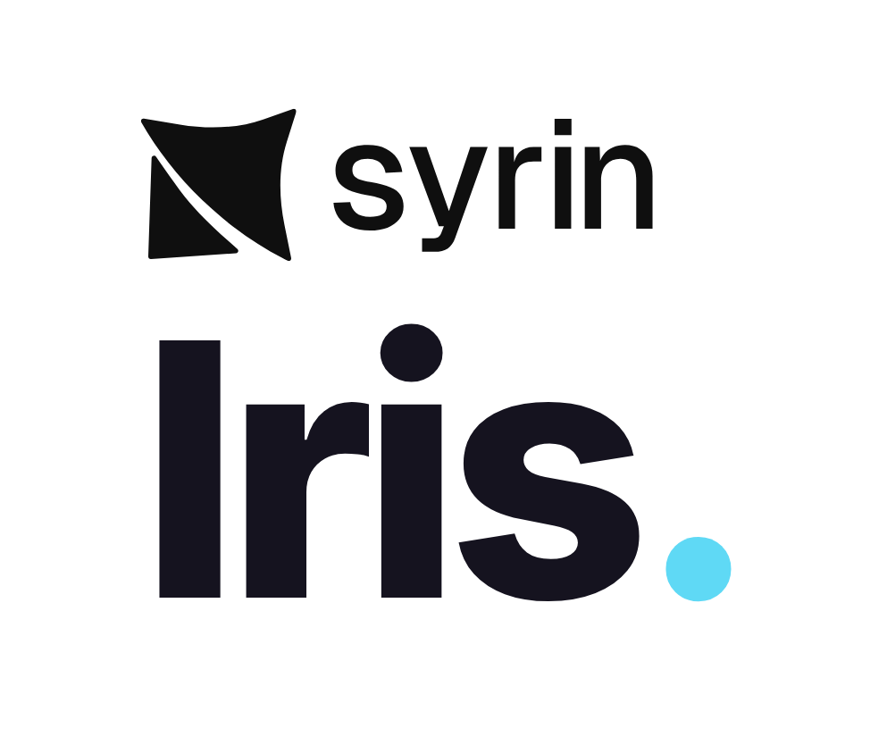
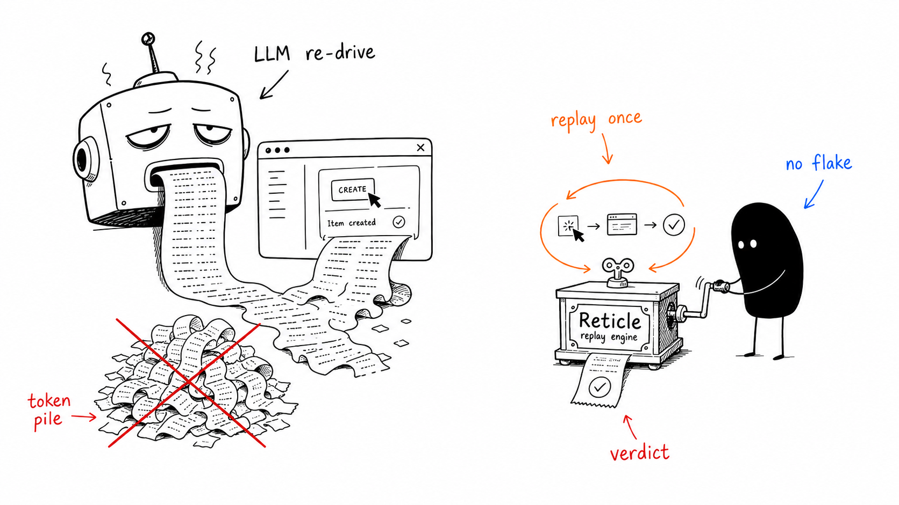
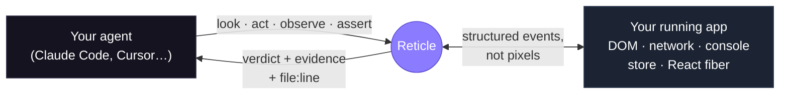
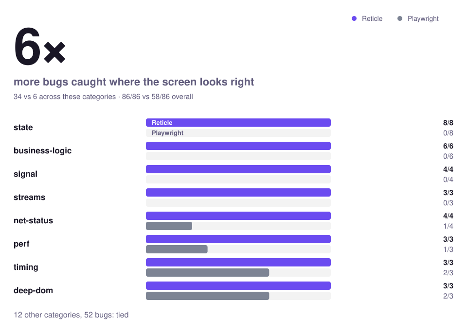
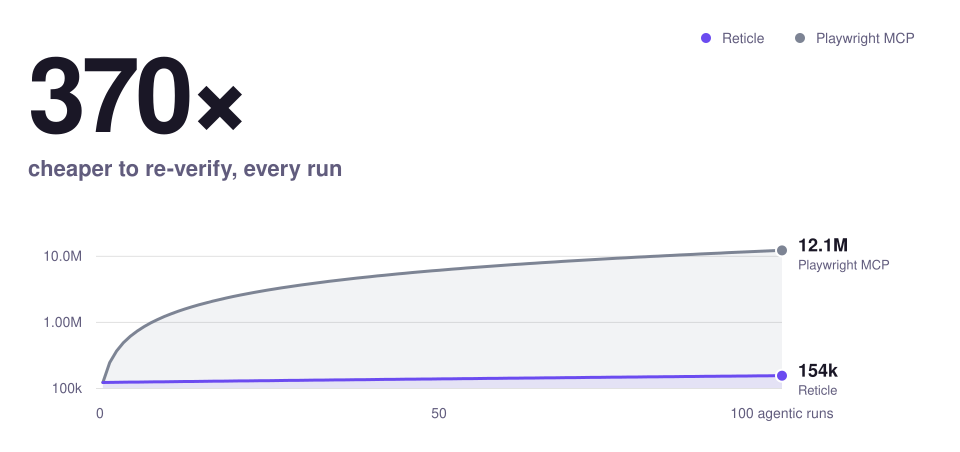
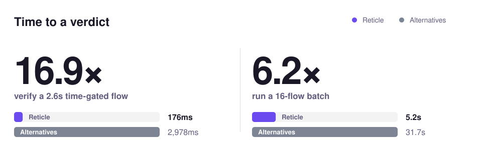

<div align="center">

<picture>
  <source media="(prefers-color-scheme: dark)" srcset="assets/readme/lockup-on-dark.png" />
  
</picture>

<br/>

**Your AI agent says "done." Reticle checks whether that's true.**

It drives your real running app, reads what actually happened, and hands back **pass · fail · couldn't tell** with the `file:line` to fix.

<br/>

[](https://www.npmjs.com/package/@reticlehq/server) [](https://www.npmjs.com/package/@reticlehq/react) [](https://github.com/reticlehq/reticle/stargazers) [](LICENSE) [](https://securityscorecards.dev/viewer/?uri=github.com/reticlehq/reticle) [](https://discord.gg/BwAbzv9ZRz)

[**Install**](#install) · [**Use it**](#use-it) · [How it works](#how-it-works) · [vs Playwright](#why-not-playwright) · [Benchmarks](#benchmarks) · [Limits](#limits) · [Docs](https://docs.reticle.sh)

<br/>

<a href="https://www.youtube.com/watch?v=XCC0wST0rJA&loop=1&playlist=XCC0wST0rJA">
  
</a>

<sub>▶ Two minutes. An agent finds a bug the screen was hiding, and proves the fix.</sub>

</div>

---

## Install

Three steps. The first one is the whole install.

### 1. Run the installer

**macOS · Linux**

```bash
curl -fsSL https://raw.githubusercontent.com/reticlehq/reticle/main/install/install.sh | sh
```

**Windows** (PowerShell)

```powershell
irm https://raw.githubusercontent.com/reticlehq/reticle/main/install/install.ps1 | iex
```

It puts `reticle` on your PATH and registers the MCP server with **every coding agent it can reach**: Claude Code, Cursor, Windsurf, VS Code, Zed, Gemini CLI, Copilot CLI, OpenCode, Warp, Kiro, Amazon Q, Cline, Amp, Continue and Factory Droid. Nothing is asked. Nothing is written outside your agent configs and `~/.reticle`.

Codex CLI keeps a TOML config we don't rewrite, so the installer prints the four lines to paste and where they go. It tells you; it doesn't pretend.

### 2. Open your coding agent

That's it. The tools are already there, because the installer wrote the config before your agent started.

> **Run the installer first, in a terminal.** A coding agent reads its MCP server list once at startup. Install while it's closed and there is nothing to restart. If it was already open, quit and reopen it once.

### 3. Wire your app

In your project, let your agent run:

```bash
RETICLE_INSTALL_SOURCE=readme npx @reticlehq/server init
```

Like `npm init` or `git init`, this is the per-project step. It installs the dev-only SDK, wires your build config, restarts your dev server, and then **opens your app and proves a session connected.** A config file is not an install, so `init` doesn't stop until it has seen your app.

**Step 1 is once per machine. This step is once per project.**

### Check it worked

```bash
npx @reticlehq/server doctor
```

Or just ask your agent: _"Is Reticle connected to my app?"_

<details>
<summary><b>Manual install</b> (no pipe to shell)</summary>

<br/>

```bash
npm install -g @reticlehq/server   # 1. the CLI
npx @reticlehq/server setup mcp    # 2. register it with your agents
```

Step 2 registers the same agents as the installer, and writes the `/reticle` skill where the agent supports one. On Claude Code it also pre-approves the Reticle tools, so there is no Accept prompt on every call.

Any other MCP client: point it at `npx @reticlehq/server mcp`.

```jsonc
{ "mcpServers": { "reticle": { "command": "npx", "args": ["@reticlehq/server", "mcp"] } } }
```

Then continue at step 2 above: open your agent, and run `npx @reticlehq/server init` in your project.

<sub>The `RETICLE_INSTALL_SOURCE` prefix above is optional. It tells us which page somebody installed from, so we know which docs are working.</sub>

Requires **Node 20.11+**.

</details>

<details>
<summary><b>Claude Code plugin</b> (skill + MCP in one step)</summary>

<br/>

```text
/plugin marketplace add reticlehq/reticle
/plugin install reticle@reticlehq
```

Registers the MCP server and installs the Reticle skill together. Reopen Claude Code once and the tools are there.

For other agents that support the skills CLI:

```bash
npx skills add reticlehq/reticle
```

</details>

---

## Use it

You never write test syntax. You say what should be true, in plain English.

**Verify what you just built**

> "I changed checkout. Verify it with Reticle before you tell me it's done."

**Find what the screen is hiding**

> "The page looks fine but something's off. Use Reticle to check what's happening underneath."

**Prove a bug is fixed**

> "Reproduce the bug with Reticle, fix it, then prove the fix with the same steps."

**Lock a flow so it can't break**

> "Record the login flow with Reticle, then re-verify it after every change."

**Sweep before you ship**

> "Walk the main routes with Reticle. Tell me anything broken."

Reticle answers with evidence: the request that fired, the state that changed, the console line, and the file to open.

---

## Why not Playwright?

Playwright, DevTools and browser agents all stand **outside** the browser looking in. For a site you don't own, that's right. For the app you're building, the bugs that matter never reach the pixels.

| Bug | Looks fine on screen? | Reticle reads |
| --- | :-: | --- |
| Pay button silently returns `500` | yes | the network response, tied to the click |
| Badge shows "12", the store holds `0` | yes | your app's state |
| The form fired the request twice | yes | request count |
| "Deploy succeeded", the deploy failed | yes | the store's real status |
| A console error slipped in | yes | the console since the action |
| Component re-renders 60×/sec | yes | the React commit stream |

**Use both.** Playwright for sites you don't own, many browsers, real pixels. Reticle for the app you're building, inside your agent's loop.

---

## The problem

Your agent writes code, **assumes** it worked, and moves on. It never opens the app.

So the broken modal, the silent `500`, the "Deploy succeeded" over a failed deploy: they all ship, and you find them by clicking around afterwards. **You've become your agent's QA.**

The truth was in the running app the whole time. It just never reached the screen.

<p align="center">
  
</p>

This isn't something your agent forgot. A coding agent is built to **produce a change**, and it's optimistic by construction. Verification is the opposite motion: going to find out, and being willing to come back with **no**.

---

## How it works

> **You:** "Verify login works."
>
> **Agent, via Reticle:** clicks **Sign in** → `POST /api/login → 200 (14 ms)` → dashboard rendered → store holds `auth: { email: "admin@…" }` → **PASS**, evidence attached.


```mermaid
flowchart LR
    A["Your agent<br/>(Claude Code, Cursor…)"] -->|"look · act · observe · assert"| B(("Reticle"))
    B <-->|"structured events,<br/>not pixels"| C["Your running app<br/>DOM · network · console<br/>store · React fiber"]
    B -->|"verdict + evidence<br/>+ file:line"| A
    style B fill:#8b7bff,stroke:#5b4bd0,color:#fff
    style A fill:#15131f,stroke:#3a3550,color:#fff
    style C fill:#1c2433,stroke:#2f3d57,color:#fff
```

One call checks many things at once. Say _"save that as a flow"_ and it replays on every later edit with no model in the loop, so today's fix can't quietly break last week's feature.

<details>
<summary><b>What one call looks like underneath</b></summary>

<br/>

```jsonc
// The agent clicked "Pay". Did the right things actually happen?
reticle_assert({
  predicate: { allOf: [
    { kind: "net",     method: "POST", urlContains: "/api/order", status: 200 },
    { kind: "element", query: { role: "dialog", name: "Order confirmed" }, state: "visible" },
    { kind: "signal",  name: "order:saved" },          // the charge actually committed
    { kind: "console", level: "error", absent: true }  // …and nothing errored
  ]}
})
// → { pass: false,
//     failureReason: "POST /api/order returned 500, expected 200",
//     source: { file: "src/checkout/PayButton.tsx", line: 42 } }
```

</details>

---

## Benchmarks

88 real regressions injected into a controlled app, Reticle against a Playwright script. Every number comes from a committed harness. Reproduce it with `pnpm bench`.

<p align="center">
  
</p>

<p align="center">
  
</p>

Re-verification has no model in the loop, so a recorded suite is a fixed, tiny read. Reticle is ahead from the second run even when charged a full LLM drive to author the suite.

<p align="center">
  
</p>

Faster for a structural reason rather than a browser-speed one: a time-gated transition is verified from the event stream instead of waited out, and a batch of flows runs as a batch.

---

## Limits

A verification tool that oversells its reach is worse than none.

|  |  |
| --- | --- |
| **Strong** | silent failed requests, state that disagrees with the screen, stale caches, double-submits, a write that failed while the UI moved on |
| **Partial** | races around a single action. It detects `request-never-settled` and `duplicate-request`; it is not a scheduler-level race analyser |
| **Not the tool** | cross-browser rendering, visual regressions, sites you don't own. That's Playwright |
| **Can't see yet** | IndexedDB, Web Workers, closed shadow roots, cross-origin iframes |

**When Reticle can't see something, it says so.** A verdict is `yes`, `no`, or `unknown`, where `unknown` means the evidence couldn't decide. Never a quiet pass.

**Cost:** zero bytes in production. The SDK sits behind `import.meta.env.DEV` and is dead-code eliminated; a runtime guard refuses to connect under `NODE_ENV=production`. No app data leaves your machine.

---

## Supported

|  |  |
| --- | --- |
| **Web** | Next.js (App + Pages), Vite + React, CRA, SvelteKit, Svelte, Astro, Vue 3, Preact, plain HTML |
| **Desktop** | Electron, Tauri, including the IPC boundary a browser-only tool can't see |
| **Agents** | anything that speaks MCP. Config written automatically for Claude Code, Cursor, Windsurf, VS Code, Zed, Gemini CLI, Copilot CLI, OpenCode, Warp, Kiro, Amazon Q, Cline, Amp, Continue, Factory Droid. Codex CLI is a printed four-line paste |
| **Browsers** | Chrome, Edge, Arc, Brave, Opera, Firefox, Safari, plus Electron and Tauri webviews |
| **State** | zustand and Redux need no adapter. Shipped: TanStack Query, Jotai, XState, Valtio, MobX, Recoil, Svelte stores, Pinia |
| **OS** | macOS, Linux, Windows |

---

## On the roadmap

**Routing verification flows with [TypeSafe AI](https://typesafe.ai)'s [Jev](https://typesafe.ai/blog/introducing-system-one-models-and-jev).** A verification run makes a lot of small decisions — is this page settled, is this finding worth chasing, does this failure warrant a full capture — and today an LLM answers each one at LLM latency and LLM cost. Jev is a System One model: it returns a typed, probabilistic choice from a fixed set instead of prose, in 70–500ms. That is the exact shape of a routing decision inside Reticle's infra, so when we build that layer, Jev is what decides which flow a run takes. That layer is the roadmap item; it does not ship yet.

What DOES ship, since 3.2.0, is Jev driving the app rather than routing inside it: `reticle_verify { action: "explore", driver: "jev" }` explores a page by selecting from candidates Reticle enumerated off the DOM, so the model chooses and never composes. See [docs/autodrive.md](docs/autodrive.md).

## Docs

**[docs.reticle.sh](https://docs.reticle.sh)** — a page per tool, a page per command, every example captured from a real run.

[Quickstart](https://docs.reticle.sh/quickstart) · [Frameworks](https://docs.reticle.sh/frameworks) · [Troubleshooting](https://docs.reticle.sh/troubleshooting) · [Architecture](docs/architecture.md) · [Contributing](CONTRIBUTING.md)

## Community

**[Join the Discord →](https://discord.gg/BwAbzv9ZRz)** Where the work happens in the open: what's being built, what's up for grabs, and design calls before they land.

<a href="https://github.com/reticlehq/reticle/graphs/contributors"></a>

If Reticle proves useful, a ⭐ helps other developers find it.

## License

SDK and adapters are **Apache-2.0**. The server is **FSL** (source-available, converts to Apache-2.0 after two years). See [LICENSE](LICENSE).

`dev-only` · `localhost-only` · `your app data stays local`
