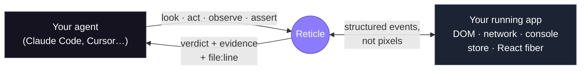

<div align="center">

<picture>
  <source media="(prefers-color-scheme: dark)" srcset="assets/readme/lockup-on-dark.png" />
  
</picture>

<br/>

**Your AI agent says "done." Reticle checks whether that's true.**

It drives your real running app, reads what actually happened, and hands back **pass · fail · couldn't tell** with the `file:line` to fix.

<br/>

[](https://www.npmjs.com/package/@reticlehq/server) [](https://www.npmjs.com/package/@reticlehq/react) [](https://github.com/reticlehq/reticle/stargazers) [](LICENSE) [](https://securityscorecards.dev/viewer/?uri=github.com/reticlehq/reticle) [](https://discord.gg/BwAbzv9ZRz)

[**Install**](#install) · [**Use it**](#use-it) · [Use cases](#what-people-use-reticle-for) · [How it works](#how-it-works) · [vs Playwright](#why-not-playwright) · [Benchmarks](#benchmarks) · [Safe to install](#built-to-be-safe-to-install) · [Docs](https://docs.reticle.sh)

<br/>

<!-- An animated image, because GitHub strips iframes and no embedded player can autoplay here. Mux
     serves at most 10 seconds as a GIF; the link opens the full video. -->
<a href="https://player.mux.com/ap7hnnu4j36BRV6wEcop1NZVpJTjVSedxpW1AaXdD3I?metadata-video-title=reticle%27s+demo+&video-title=reticle%27s+demo+">
  
</a>

<sub>▶ An agent says its fix works. Reticle catches the double charge it missed. Click for the full demo.</sub>

</div>

---

## Install

You need Node **20.11+**. Install Reticle once on your machine, then connect each app you want to verify. The installer registers Reticle's tools with the coding agents it finds; the project command wires your app and checks that a browser session actually connects.

### 1. Install once on your machine

**macOS · Linux**

```bash
curl -fsSL https://raw.githubusercontent.com/reticlehq/reticle/main/install/install.sh | sh
```

**Windows** (PowerShell)

```powershell
irm https://raw.githubusercontent.com/reticlehq/reticle/main/install/install.ps1 | iex
```

The installer installs the `reticle` CLI, registers its MCP server with supported agents, and configures approval for Reticle's own tools where the agent supports it. **Run it in a terminal before opening your coding agent.** If your agent is already open, restart it once so it loads the new tools. Codex CLI needs a manual TOML entry; the installer prints the exact lines and location.

### 2. Connect your app

From your app's directory, run:

```bash
reticle connect --project "My App"
```

Use the project name you want to see on your dashboard. This command installs the dev-only SDK, wires your build config, starts your dev server, and proves that the app connected. It then opens a browser for sign-in approval, links this folder to your cloud project, and sends any Reticle history already on this machine. Approve the short code shown in both the browser and terminal; the command finishes on its own. If you are already signed in, it reuses that session. You do not need to copy an API key.

Want to verify locally without an account? Run `reticle init` instead. Nothing from your project goes to the cloud until you choose to connect it. [See exactly what can sync](docs/what-is-recorded.md). To preview the app changes first, run `reticle init --dry-run`.

### Check it and start verifying

```bash
reticle doctor    # is the app connected?
reticle whoami    # which cloud project is this folder linked to?
```

Open or restart your coding agent, then ask: _“Verify one flow in my running app with Reticle.”_ Reticle returns a pass, fail, or couldn't-tell verdict with evidence. Your dashboard fills after the first recorded run; a new app has no results to sync yet. If your dev server was already running before Reticle wired it, restart that server once to load the new config.

<a id="manual-install"></a>
<details>
<summary><b>Manual install</b> (no pipe to shell)</summary>

<br/>

```bash
npm install -g @reticlehq/server   # 1. the CLI
npx @reticlehq/server setup mcp    # 2. register it with your agents
```

Step 2 registers the same agents as the installer, writes the `/reticle` skill where the agent supports one, and pre-approves Reticle's own tools the same way. To register nothing automatically, skip step 2 and add the server to your client yourself, which leaves its approval prompts as they are:

```jsonc
{ "mcpServers": { "reticle": { "command": "npx", "args": ["@reticlehq/server", "mcp"] } } }
```

Then run `reticle connect --project "My App"` in your app directory, or `reticle init` for local-only use.

</details>

<details>
<summary><b>Claude Code plugin</b> (skill + MCP in one step)</summary>

<br/>

```text
/plugin marketplace add reticlehq/reticle
/plugin install reticle@reticlehq
```

Registers the MCP server and installs the Reticle skill together. Reopen Claude Code once and the tools are there.

For other agents that support the skills CLI:

```bash
npx skills add reticlehq/reticle
```

</details>

---

## Use it

You never write test syntax. You say what should be true, in plain English.

<p align="center">
  
</p>

**Verify what you just built**

> "I changed checkout. Verify it with Reticle before you tell me it's done."

**Find what the screen is hiding**

> "The page looks fine but something's off. Use Reticle to check what's happening underneath."

**Prove a bug is fixed**

> "Reproduce the bug with Reticle, fix it, then prove the fix with the same steps."

**Lock a flow so it can't break**

> "Record the login flow with Reticle, then re-verify it after every change."

**Sweep before you ship**

> "Walk the main routes with Reticle. Tell me anything broken."

Reticle answers with evidence: the request that fired, the state that changed, the console line, and the file to open.

### What people use Reticle for

Anything the running app does is something an agent can check. Beyond verifying agent-built changes, people use Reticle for:

- **Security checks.** Access control holds for each role (the protected call returns `403`), forbidden calls fire zero times, a secret never renders in the page, and CSP violations surface as console errors. It proves your app's security behaviour and pairs with a vulnerability scanner, which finds the holes.
- **Accessibility and UX.** Controls are reachable by role and accessible name, focus moves into a dialog when it opens, and `Enter` or `Escape` fires the action from the keyboard. Pairs with a full WCAG audit such as axe.
- **Performance and monitoring.** One request per action instead of five, largest-contentful-paint, layout shift and long tasks read from the page, React render counts, and saved flows replayed against staging in CI.
- **SEO checks.** Page title, headings, every link with its `href`, redirects landing on the right route, and a crawl that finds dead controls and failed requests.
- **Personas and simulation.** `explore` drives a journey described in plain words (`--persona "a new user who signs up"`), each role gets its own isolated browser context, and several agents drive the same app in parallel.

Each one, with what it checks and a call you can run: [docs.reticle.sh/use-cases](https://docs.reticle.sh/use-cases).

**Make it unavoidable in CI**

```bash
npx @reticlehq/server gate --since HEAD~1
```

`gate` works out which saved flows your edits affect and exits non-zero unless a **passing** artifact covers each one. An agent that edits a covered file cannot call itself finished without re-verifying, and it is the one check nobody can satisfy by reasoning about their own diff. See [`docs/cli/gate.mdx`](docs/cli/gate.mdx).

---

## Why not Playwright?

Playwright, DevTools and browser agents all stand **outside** the browser looking in. For a site you don't own, that's right. For the app you're building, the bugs that matter never reach the pixels.

| Bug | Looks fine on screen? | Reticle reads |
| --- | :-: | --- |
| Pay button silently returns `500` | yes | the network response, tied to the click |
| Badge shows "12", the store holds `0` | yes | your app's state |
| The form fired the request twice | yes | request count |
| "Deploy succeeded", the deploy failed | yes | the store's real status |
| A console error slipped in | yes | the console since the action |
| Component re-renders 60×/sec | yes | the React commit stream |

**Use both.** Playwright for sites you don't own, many browsers, real pixels. Reticle for the app you're building, inside your agent's loop.

---

## The problem

Your agent writes code, **assumes** it worked, and moves on. It never opens the app.

So the broken modal, the silent `500`, the "Deploy succeeded" over a failed deploy: they all ship, and you find them by clicking around afterwards. **You've become your agent's QA.**

The truth was in the running app the whole time. It just never reached the screen.

<p align="center">
  
</p>

This isn't something your agent forgot. A coding agent is built to **produce a change**, and it's optimistic by construction. Verification is the opposite motion: going to find out, and being willing to come back with **no**.

---

## How it works

> **You:** "Verify login works."
>
> **Agent, via Reticle:** clicks **Sign in** → `POST /api/login → 200 (14 ms)` → dashboard rendered → store holds `auth: { email: "admin@…" }` → **PASS**, evidence attached.

<p align="center">
  
</p>


```mermaid
flowchart LR
    A["Your agent<br/>(Claude Code, Cursor…)"] -->|"look · act · observe · assert"| B(("Reticle"))
    B <-->|"structured events,<br/>not pixels"| C["Your running app<br/>DOM · network · console<br/>store · React fiber"]
    B -->|"verdict + evidence<br/>+ file:line"| A
    style B fill:#8b7bff,stroke:#5b4bd0,color:#fff
    style A fill:#15131f,stroke:#3a3550,color:#fff
    style C fill:#1c2433,stroke:#2f3d57,color:#fff
```

<p align="center">
  
</p>

<sub align="center">A verdict points at the line that caused it. That pointer is the difference between "something broke" and a fix.</sub>

One call checks many things at once. Say _"save that as a flow"_ and it replays on every later edit with no model in the loop, so today's fix can't quietly break last week's feature.

<p align="center">
  
</p>

<details>
<summary><b>What one call looks like underneath</b></summary>

<br/>

```jsonc
// The agent clicked "Pay". Did the right things actually happen?
reticle_assert({
  predicate: { allOf: [
    { kind: "net",     method: "POST", urlContains: "/api/order", status: 200 },
    { kind: "element", query: { role: "dialog", name: "Order confirmed" }, state: "visible" },
    { kind: "signal",  name: "order:saved" },          // the charge actually committed
    { kind: "console", level: "error", absent: true }  // …and nothing errored
  ]}
})
// → { pass: false,
//     failureReason: "POST /api/order returned 500, expected 200",
//     source: { file: "src/checkout/PayButton.tsx", line: 42 } }
```

</details>

---

## Benchmarks

88 real regressions injected into a controlled app, Reticle against a Playwright script. Every number comes from a committed harness. Reproduce it with `pnpm bench`.

<p align="center">
  
</p>

<p align="center">
  
</p>

Re-verification has no model in the loop, so a recorded suite is a fixed, tiny read. Reticle is ahead from the second run even when charged a full LLM drive to author the suite.

<p align="center">
  
</p>

<p align="center">
  
</p>

Faster for a structural reason rather than a browser-speed one: a time-gated transition is verified from the event stream instead of waited out, and a batch of flows runs as a batch.

---

## Capabilities and limits

|  |  |
| --- | --- |
| **Strong** | silent failed requests, state that disagrees with the screen, stale caches, double-submits, a write that failed while the UI moved on |
| **Partial** | races around a single action. It detects `request-never-settled` and `duplicate-request`; it is not a scheduler-level race analyser |
| **Can't see yet** | IndexedDB, Web Workers, closed shadow roots, cross-origin iframes |

**When Reticle can't see something, it says so.** A verdict is `yes`, `no`, or `unknown`, where `unknown` means the evidence couldn't decide. Never a quiet pass.

**Pairs well with:** a visual testing tool for pixel-level diffs, Playwright for sites you don't own and a cross-browser matrix, axe for full WCAG audits, and a security scanner for vulnerability discovery. Reticle checks what your own app does; those tools cover the rest.

---

## Built to be safe to install

- **Dev-only SDK.** It sits behind `import.meta.env.DEV` (the Vite plugin applies only to `serve`) and is dead-code eliminated from production builds, and a runtime guard refuses to connect when the build reports `NODE_ENV=production`.
- **Localhost-only bridge.** The daemon binds `127.0.0.1`, and an app pairs with it using a token stored owner-only at `~/.reticle/pairing-token`, so another page on your machine cannot drive your session.
- **No arbitrary code.** The SDK runs a fixed set of commands (look, act, read state, navigate). There is no "evaluate this JavaScript" tool.
- **Credentials redacted at the source.** Passwords, tokens, API keys and card numbers in captured request and response bodies, storage and state are replaced with `[REDACTED]` before they reach the agent.
- **Your app's data stays on your machine.** DOM, network bodies, console output, state and source are never sent anywhere. You need no account, and a verdict is produced locally. If you choose to connect a project (`reticle login` and `reticle link`, or `RETICLE_API_KEY` in CI), what syncs is yours to set with `reticle config --runs/--memory/--flows on|off`, and [what each contains is written down](docs/what-is-recorded.md).
- **Anonymous usage counts are sent by default:** which commands ran, which tools an agent called, whether a verdict was produced, with a random id and nothing from your app. `reticle telemetry disable`, `RETICLE_TELEMETRY=0` or `DO_NOT_TRACK=1` turns them off. [The complete list](docs/telemetry.md).
- **You see the plan first.** `init --dry-run` writes nothing; `--no-mcp` skips agent registration; `--files-only` writes the files and stops. Reporting a security issue: [SECURITY.md](SECURITY.md).

---

## Supported

|  |  |
| --- | --- |
| **Web** | React + Vite, Next.js, Remix and Astro are driven to a verdict in CI; more frameworks are install-gated or wired. **[Frameworks](docs/frameworks.mdx) is the one list of what is proven, and how far** |
| **Desktop** | Electron, Tauri, including the IPC boundary a browser-only tool can't see |
| **Agents** | anything that speaks MCP. Config written automatically for Claude Code, Cursor, Windsurf, VS Code, Zed, Gemini CLI, Copilot CLI, OpenCode, Warp, Kiro, Amazon Q, Cline, Amp, Continue, Factory Droid. Codex CLI is a printed four-line paste |
| **Browsers** | the SDK runs in the tab you already have open; the tested and driven browser is Chromium, plus Electron and Tauri webviews |
| **State** | zustand and Redux need no adapter. Shipped: TanStack Query, Jotai, XState, Valtio, MobX, Recoil, Svelte stores, Pinia |
| **OS** | macOS, Linux, Windows |

---

## On the roadmap

**Routing verification flows with [TypeSafe AI](https://typesafe.ai)'s [Jev](https://typesafe.ai/blog/introducing-system-one-models-and-jev).** A verification run makes a lot of small decisions — is this page settled, is this finding worth chasing, does this failure warrant a full capture — and today an LLM answers each one at LLM latency and LLM cost. Jev is a System One model: it returns a typed, probabilistic choice from a fixed set instead of prose, in 70–500ms. That is the exact shape of a routing decision inside Reticle's infra, so when we build that layer, Jev is what decides which flow a run takes. That layer is the roadmap item; it does not ship yet.

What DOES ship, since 3.2.0, is Jev driving the app rather than routing inside it: `reticle_verify { action: "explore", driver: "jev" }` explores a page by selecting from candidates Reticle enumerated off the DOM, so the model chooses and never composes. See [docs/autodrive.md](docs/autodrive.md).

## Docs

**[docs.reticle.sh](https://docs.reticle.sh)** — a page per tool, a page per command, every example captured from a real run.

[Quickstart](https://docs.reticle.sh/quickstart) · [Frameworks](https://docs.reticle.sh/frameworks) · [Troubleshooting](https://docs.reticle.sh/troubleshooting) · [Architecture](docs/architecture.md) · [Contributing](CONTRIBUTING.md)

## Get help and community

**[Join the Discord →](https://discord.gg/BwAbzv9ZRz)** Where the work happens in the open: what's being built, what's up for grabs, and design calls before they land.

Stuck on setup, or want to talk through your use case? [Book a call with the founders](https://calendar.app.google/h9NRDbBBQetyTzWM6), or open an [issue](https://github.com/reticlehq/reticle/issues).

<a href="https://github.com/reticlehq/reticle/graphs/contributors"></a>

If Reticle proves useful, a ⭐ helps other developers find it.

## License

- **The SDK, adapters, core and engine are Apache-2.0.** Ship them inside your own apps.
- **The server, CLI and `init` are FSL-1.1-ALv2:** free for any use except offering Reticle itself as a competing product or service, and each version becomes Apache-2.0 two years after release.
- **Enterprise features need a license key** in production; they are free for development and evaluation.

[LICENSE](LICENSE) has the details.

`dev-only` · `localhost-only` · `your app data stays local`
