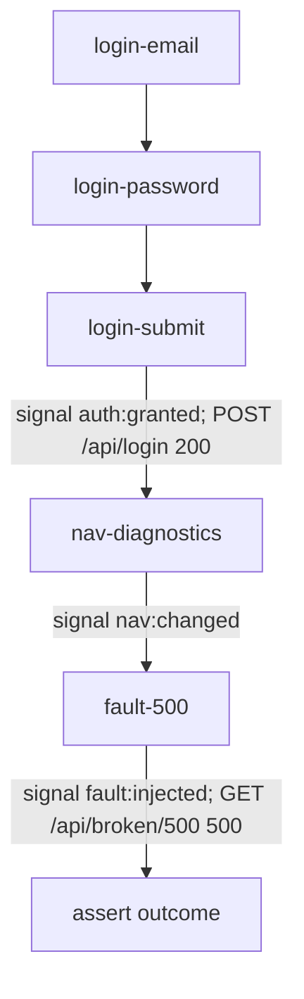

# Flow report — `report-verify-500`

**Intent:** inject a 500 server fault from diagnostics and observe it fire — **verified** (an observable outcome is asserted).
**Verdict:** ✅ pass · **steps:** 6
**Cost:** 280 tokens (deterministic replay, no LLM) · **108×** cheaper than an LLM re-drive

## Journey

| #   | page | action          | consequence                                    | result |
| --- | ---- | --------------- | ---------------------------------------------- | ------ |
| 0   | —    | login-email     | —                                              | ok     |
| 1   | —    | login-password  | —                                              | ok     |
| 2   | —    | login-submit    | signal auth:granted; POST /api/login 200       | ok     |
| 3   | —    | nav-diagnostics | signal nav:changed                             | ok     |
| 4   | —    | fault-500       | signal fault:injected; GET /api/broken/500 500 | ok     |
| 5   | —    | assert outcome  | —                                              | ok     |

## Evidence

- signal auth:granted
- POST /api/login 200
- signal nav:changed
- signal fault:injected
- GET /api/broken/500 500
