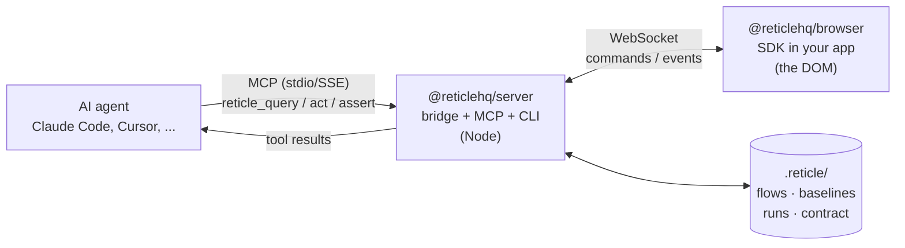

Reticle has three moving parts: a dev-only **SDK** inside your page that instruments the DOM, network, console, routing and framework state; a local **server** that runs a WebSocket bridge to that SDK and an MCP server for your agent; and a git-checked **`.reticle/` workspace** holding flows, baselines and run artifacts. Your agent calls an MCP tool, the server turns it into a command over the WebSocket, the SDK runs it in the real page and streams structured events back.

> For engineers evaluating Reticle, integrating it at scale, or contributing. It explains the moving parts, the data flow, and the design decisions behind them. If you just want to get running, start with [getting-started.md](getting-started.md); come back here when you want to know _why_.

---

## The one-paragraph model

Your app, in dev, embeds a tiny **SDK** that instruments the page (DOM, network, console, routing, framework state) and opens a WebSocket to a local **bridge**. The bridge runs inside the Reticle **server**, which also exposes an **MCP server**, the standard protocol AI agents speak.

Your coding agent calls MCP tools (`reticle_query`, `reticle_act`, `reticle_assert`, …); the server turns them into commands over the WebSocket; the SDK executes them in the page and streams back structured events. The agent thus **looks, acts, observes, and asserts** on the real running app, never on a screenshot.

---

## The packages (and the boundaries between them)

Reticle is a pnpm + Turborepo monorepo. The split is not cosmetic: each boundary enforces a rule.

| Package | Runs in | Responsibility | Hard rule |
| --- | --- | --- | --- |
| `@reticlehq/core` | both | The **wire contract**: every constant + zod schema crossing any boundary | Depends only on `zod` |
| `@reticlehq/browser` | the browser | Instrument the page; execute commands; emit events | Never imports Node APIs |
| `@reticlehq/server` | Node | The bridge, the MCP server, the `reticle` CLI, flow/run storage | Never imports DOM APIs |
| `@reticlehq/react` | the browser | The SDK **kit** you install in a browser app: re-exports the browser sensor (so one install gives both `reticle` and `install`) and maps a DOM node → React component → source `file:line` | Core works without the source-mapping half |
| `@reticlehq/babel-plugin`, `@reticlehq/next`, `@reticlehq/vite-plugin` | build time | Stamp `data-reticle-source` for source mapping (and, for Vite, inject `connect()`) | Plain tooling |
| `@reticlehq/electron` | Electron main process | Adapter for the desktop runtime: IPC observer, main-process capture | Desktop-only, outside the web gates |
| `packages/tauri` (`reticle-tauri`) | Tauri (Rust) | Capture backend for the Tauri desktop runtime | Rust, outside every JS gate; compiled by CI's `rust`/`rust-macos` jobs |
| `@reticlehq/test` | Node (dev dependency) | Spec runner + matchers used by CI's own test suites | Peer dependency on `vitest` |
| `@reticlehq/eslint-plugin` | dev tooling | Repo-internal lint rule: a state change must fire a signal | Dev-only, never shipped in a user's bundle |

> Note: pre-2.0, `@reticlehq/core` was a single umbrella package that re-exported all of the above under subpaths. In 2.0 the umbrella was retired and `@reticlehq/core` became the bottom-of-graph wire contract.

**Why core-as-contract matters:** because the browser and the server are two different runtimes (a DOM and a Node process) that must agree exactly on every message, the temptation is to inline a string like `"net.request"` in both. That's how drift and silent breakage start. Instead, every such string and shape lives once in `@reticlehq/core` as a named constant + a zod schema.

The browser and server both import it; neither can invent a message the other doesn't understand. The server zod-parses **every** inbound WebSocket message; malformed input closes the socket rather than flowing into logic.

---

## The data flow, end to end

1. **Connect.** In dev, your app calls `reticle.connect({ session })`. The SDK opens a WebSocket to the bridge (`ws://localhost:4400/reticle` by default) and sends a `HELLO` carrying the session id, protocol version, and (if configured) a pairing token. Each browser tab uses `SESSION_AUTO` (a unique id), so multiple apps/tabs never collide.
2. **Capture.** The SDK installs observers: a `MutationObserver` for DOM changes, wrappers around `fetch`/`XHR` for network, a console hook, a history hook for routing, and registries the app opts into (`registerStore`, `registerCapabilities`, `reticle.signal`). Events flow into a bounded **ring buffer**, so recent history is always available and memory is capped.
3. **Look / act.** The agent calls an MCP tool. `reticle_query` finds an element by role/text/testid/ component and returns a stable **ref**. `reticle_act` dispatches an action against that ref and returns an **effect** report (did it land, did the DOM mutate, did focus move…). The server sends the command over the WebSocket; the SDK runs it and replies.
4. **Observe.** After an action, the agent reads what happened with `reticle_network`, `reticle_console`, `reticle_state`, or the reaction digest from `reticle_act_and_wait`. The server pulls the relevant slice of the ring buffer (scoped to a cursor so stale events can't leak in) and returns a compact summary.
5. **Assert.** `reticle_assert` (and a flow's declared `success`) evaluates a **predicate** over program truth (a network call that returned 200, a store value, a `signal` the app emitted), not just "an element exists." This is the difference between "looks done" and "is done."

---

## The four design decisions that define Reticle

### 1. Assert the consequence, not the appearance

Most agent-browser tools can confirm "an element matching X is present." That's the weakest possible oracle: a wrong or healed-to-wrong element satisfies it, and the regression ships anyway. Reticle grades evidence in tiers:

- **Tier 1, an app signal** (`reticle.signal('order:placed')`): the strongest, because a wrong element can't fake it. Available when the app emits it (a ~30-second opt-in).
- **Tier 2, network + route + state**: a POST returned 200, the URL changed, a store value updated. Strong, and works on most SPAs with no setup.
- **Tier 3, DOM/text presence**: the weak fallback Reticle nudges _away_ from.

Reticle is honest about which tier a given assertion used, so "green" carries its own confidence.

### 2. Structured reads, not screenshots

A screenshot is ~1,365 image tokens per look, slow, non-deterministic, and **blind to everything non-visual**: the failed request, the console error, the route that didn't change. Reticle reads the accessibility tree, the network log, the console, and framework state as compact structured data. That's an order of magnitude cheaper _and_ it sees the bugs pixels can't. See [benchmarks.md](benchmarks.md) for the measured comparison.

### 3. Record once, replay deterministically

The same verification runs over and over, every commit, every CI run. Reticle records a **flow** once, then replays it with **no AI model**: it re-resolves each element's durable anchor against the live DOM and re-asserts the declared consequence. A CI gate diffs the verdict exactly, at ~0% flake, for a couple hundred tokens, versus an agent re-driving the whole flow with the model every time. Self- healing rebinds a drifted anchor **only if the consequence still fires**, so it never "heals to the wrong element and ships the regression."

### 4. Dev-only, localhost-only, your app data stays local

The SDK is tree-shaken out of production builds and connects only to a local bridge. The bridge binds to loopback by default; exposing it beyond localhost _requires_ a pairing token (the server refuses to bind a non-loopback host without one). Every environment variable that gates a security control is a single named constant, so a typo can't silently disable auth. Nothing from the app under test ever leaves your machine: no DOM, network, console, state, or source. The CLI reports anonymous, opt-out usage metrics only (a random id + event names like `invoke`/`session_start`; no code, no PII; see [telemetry](telemetry.md)); opt out with `reticle telemetry disable`, `RETICLE_TELEMETRY=0`, or `DO_NOT_TRACK=1`. The one thing that carries free text is feedback you or your agent deliberately send (`reticle feedback` / `reticle_feedback`). It is never collected passively, it is redacted before sending, and it is disabled separately with `RETICLE_FEEDBACK=0`.

---

## State on disk: the `.reticle/` workspace

The server persists project state under `.reticle/` in your repo:

- **`flows/`** holds recorded, replayable flows (the golden journeys).
- **`baselines/`** holds saved snapshots for diffing.
- **`runs/`** holds verification run artifacts (the evidence trail; writes are atomic and bounded so a crash never leaves a half-written artifact, and the directory is pruned).
- **the capabilities contract** is the testids/signals/stores/flows the app advertises, frozen under a version so the public artifact can't break silently.

This is plain, reviewable, version-controllable data, not a black box.

---

## Running at scale (multiple apps, multiple projects)

- **Multiple apps / tabs on one bridge:** fine. Each connection has a unique `SESSION_AUTO` id; a tool call targets the focused/most-recent session, or you pass an explicit `sessionId`.
- **Multiple isolated projects:** give each project its own bridge port via `RETICLE_PORT` (set it in the MCP config and dial the same port from the app). A port already in use fails fast with a clear error rather than hanging. See [getting-started.md → Running multiple apps](getting-started.md#running-multiple-apps-at-once).
- **CI / no MCP:** `reticle verify <url>` replays the saved flows headlessly and exits non-zero on failure. It writes the same verdict artifact the MCP path produces, with no agent in the loop.

---

## Open-core licensing (what's free, what's protected)

- The embeddable **SDK** (`-core`, `-browser`, `-react`) is **Apache-2.0**, safe to ship inside your own app.
- The **server / CLI** is under the **Functional Source License (FSL-1.1, Apache-2.0 future)**: source-available, converts to Apache-2.0 over time.
- Enterprise-only features live behind a license gate and are clearly separated.

See [LICENSE](../LICENSE) and each package's own `LICENSE` file. The licensing _mechanism_ is open and inspectable; activation is offline (no phone-home).

---

## Where to go next

- [getting-started.md](getting-started.md) wires Reticle into your app in a couple of minutes.
- [benchmarks.md](benchmarks.md) covers how we measure, and the honest results vs the alternatives.
- [usage.md](usage.md) is the full tool reference and advanced modes.
- [CONTRIBUTING.md](../CONTRIBUTING.md) has the development loop and the rules.
