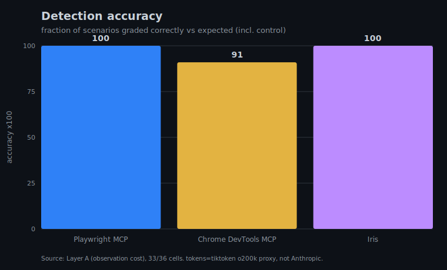
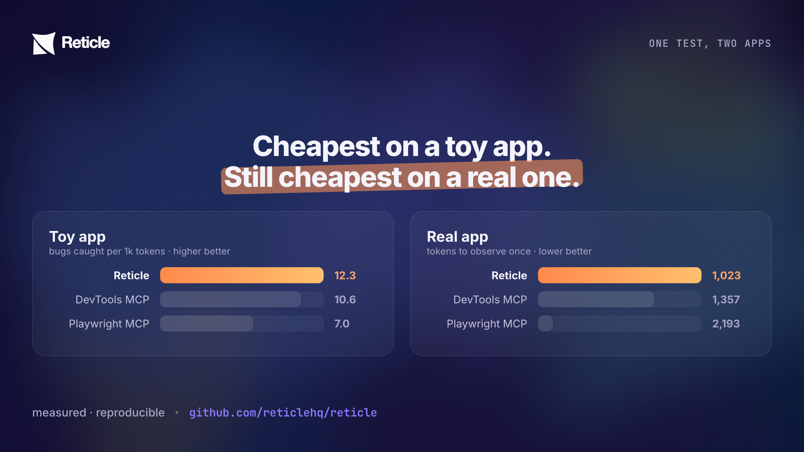
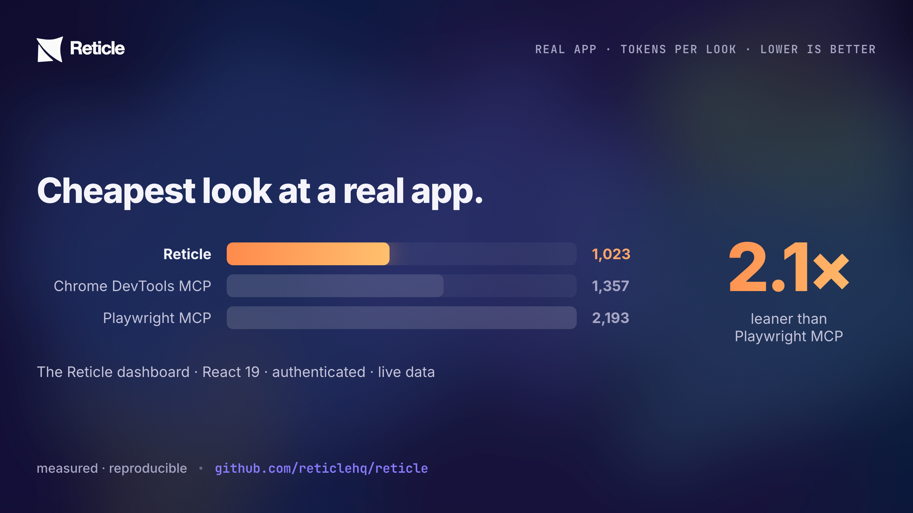
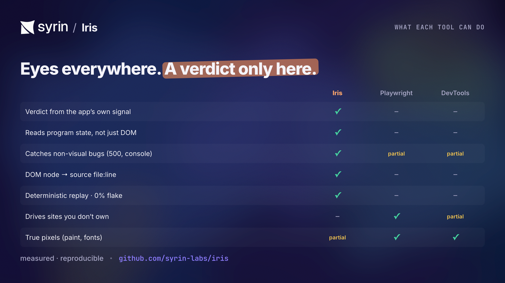
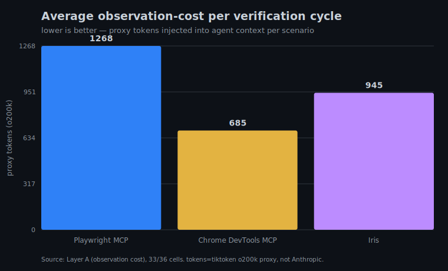

# How we benchmark Reticle (and why you can trust the numbers)

> This page assumes **zero** testing background. By the end you'll understand what software testing is, why AI coding agents made it urgent, how to tell a good verification tool from a bad one, and exactly how Reticle measures up against the main alternatives — including the places Reticle loses. If a term looks like jargon, it's defined the first time it appears.
>
> _The headline charts below are rendered from the measured numbers (`assets/readme/`, regenerated by `node bench/harness/make-readme-charts.mjs`); supporting diagrams live in `bench/artifacts/`._

---

## Part 1 — The problem, from first principles

### What is "testing"?

When you build software, **testing** is the act of checking that it actually does what it's supposed to. You click the button; does the thing happen? You submit the form; did the order get saved?

There are roughly three ways teams do this:

1. **Manual testing** — a human clicks through the app. Accurate, but slow and easy to skip.
2. **Automated tests** — code that clicks through the app for you. Fast to re-run, but expensive to write and notoriously **flaky** (they break for reasons unrelated to real bugs).
3. **Nothing** — ship and hope. More common than anyone admits: surveys put ~44% of teams with no automated testing at all.

A **regression** is the specific bug this page cares about: something that _used to work_ and quietly _stopped working_ after a change. Regressions are insidious because the feature looked done — until a later edit broke it and nobody noticed.

### Why AI agents made this urgent

AI coding agents now write a large share of new code. They're good at _producing_ code. They are bad at one specific thing: **knowing whether the code they wrote actually works.** The agent edits files, says _"done ✅"_, and moves on. It never opened the browser. So **you** become its QA department — clicking around to discover that "done" wasn't done. Developers describe being _"gaslit by coding assistants."_ This is the **"done lie."**

The honest fix is to give the agent a way to _check its own work_ — to drive the real running app and confirm the feature actually happened. That's what Reticle does. This page is about proving it does it **well**, not just that it does it.

---

## Part 2 — How would you even measure "good"?

Imagine three verification tools. How do you decide which is best? Two things matter, and they pull against each other:

- **Coverage** — does it actually _catch the bug_? A tool that misses regressions is useless no matter how cheap it is.
- **Cost** — how much does it make the AI _read_ to do its job? Every observation is fed into the model's limited context as **tokens** (the unit models read/write in). A tool that floods the context with thousands of tokens per look is slow, expensive, and crowds out the actual work.

A tool can cheat either axis: be cheap by looking at almost nothing (and miss bugs), or be thorough by dumping everything (and blow the budget). So the real metric has to reward **both at once**, with coverage as a hard floor.

That gives us our headline number:

> **Verification Efficiency = real regressions caught per 1,000 tokens spent looking** — and it only counts once the tool catches **100% of the bugs** with **zero false alarms** on a known-good control. (Historically abbreviated "VE"; the catch-rate floor was "RCR".)

A **false positive** (or "false alarm") is crying wolf — flagging a bug when nothing is wrong. We require zero, because a tool you can't trust when it's quiet is a tool you'll learn to ignore.

---

## Part 3 — The competitors, and why these three

We compare Reticle against the two most credible agent-native browser tools, because they're what an AI agent would otherwise reach for:

- **Playwright MCP** — Microsoft's tool that lets an agent drive a browser via the accessibility tree (not screenshots). The closest "serious" alternative.
- **Chrome DevTools MCP** — Google's tool exposing Chrome's DevTools to an agent.
- **(Baseline) screenshot agents** — the common "let the model look at a picture" approach.

Why not compare to traditional test frameworks (Playwright the library, Cypress, etc.)? Because those are written and maintained by humans; they don't answer "can an _agent_ verify its own work in the loop." The three above do, so it's an apples-to-apples agent comparison.

Tool versions are pinned in `bench/raw/run-meta.json` so any run is reproducible.

---

## Part 4 — The three measurement passes

Different questions need different rigs. We run three (kept in the raw files as "Layer A/B/C"):

1. **Observation-cost pass** (no AI model involved). For each bug scenario we run each tool's natural recipe and measure the exact size of what it returns — characters, bytes, and a tokenizer count. No model means no randomness: the token cost of _looking_ is measured precisely and repeatably.
2. **Full-agent-loop pass** (a real model drives). Here an actual AI agent uses each tool end-to-end, and we record the _authoritative_ token usage the model reports. This is the real-world number; it needs an API key, so it's run periodically rather than on every change.
3. **Replay pass** (no model). Reticle can record a flow once and _replay_ it deterministically with no AI at all. This measures the cost of re-checking a known flow — the thing a test suite does over and over, every commit.

### The scenarios

We inject **10 realistic regressions** into a demo app plus **one no-bug control** (to catch false alarms). The bugs span the failure modes that matter — and deliberately include ones that are _invisible to a screenshot_:

| Scenario | The bug | Why it's here |
| --- | --- | --- |
| Hidden API 500 | A request silently returns a server error | A screenshot can't see a failed network call |
| Wrong status 404 | A request 404s | Same — non-visual |
| CORS blocked | A request is blocked by the browser | Non-visual |
| Silent DOM removal | A KPI card vanishes with no error | Tests "did content disappear?" |
| Route break | Navigation doesn't change the page | Common SPA bug |
| Missing modal | A dialog fails to open | Interaction regression |
| Console error, intact UI | The page looks fine but logs an error | Looks-fine-but-broken |
| Layout shift | The grid jumps / shifts | Only visible in pixels/geometry |
| Broken form validation | A form accepts bad input | Logic regression |
| Network timeout | A request hangs forever | A request that never resolves never "logs" |
| **Control (no bug)** | Nothing is wrong | Anything flagged here is a false positive |

Three of these (failed request, console error, hung request) are **categorically invisible to a screenshot** — no number of pictures will ever catch them. That's a core part of the story.

---

## Part 5 — The honest results, on two very different apps

We ran this two ways on purpose: a **controlled toy app** (where we can inject exact bugs and measure detection) and a **real production app** (where the numbers are messy and honest). The story holds in both — and the real app is where it gets interesting.

### 5a — The controlled toy app (the demo)

Measured on the observation-cost pass (numbers regenerate from `bench/raw/`):

| Tool | Bugs caught (of 10) | Detection accuracy | Avg tokens per look | Verification Efficiency |
| --- | --- | --- | --- | --- |
| **Reticle** | **10 / 10** | **1.00** | **815** | **12.27** |
| Chrome DevTools MCP | 8 / 10 | 0.82 | 758 | 10.55 |
| Playwright MCP | 9 / 10 | 0.91 | 1,292 | 6.97 |

- **Reticle is the only tool that caught every regression**, with zero false alarms on the control.
- DevTools is a hair cheaper per look (758 vs 815 tokens) — **but it's cheaper because it catches less.** On the metric that combines both (Verification Efficiency), Reticle leads at 12.27 vs 10.55.
- Playwright catches a lot but is ~1.6× more expensive per look, so its efficiency is lowest here.

### 5b — A real production app (the Reticle dashboard)

A toy app is a fair lab, but it's small. The harder, more honest test is a **real, complex app** — the [Reticle](https://reticle.ai) dashboard itself: React 19, authentication, live data, ~15 routes, a node-graph view, virtualized lists. We embedded the SDK (the Vite plugin) and drove the authenticated app with all three tools. Observing it **once** (the primary snapshot + the network log):

| Tool | Snapshot | Network | **Observe total** | Can it assert success? |
| --- | --- | --- | --- | --- |
| **Reticle** | 678 | 345 | **1,023** | ✅ via the app's own `auth:logged-in` signal — **46 tok, un-fakeable** |
| Chrome DevTools MCP | 1,105 | 252 | 1,357 | ❌ DOM/network only — can describe, can't verify intent |
| Playwright MCP | 1,522 | 671 | 2,193 | ❌ DOM/network only |

On a small page everything is cheap and the gap is modest. On a **big** page the structured read pulls ahead: Reticle is **2.1× leaner than Playwright MCP** and the cheapest overall. And only Reticle can read the app's own program state (`authenticated`, `userId`, `activeProjectId`) and assert the login _actually worked_ from a signal the app emits — the others can only look at the DOM and the network and **guess**.

### 5c — The kicker: a real bug, caught live

Here's what makes the real-app test matter. On the **very first run, before we instrumented anything**, Reticle's network observation flagged two endpoints returning **`500`** — `GET /api/v1/projects` and `/recovery/incidents`, both failing with `column "deleted_at" does not exist` (a database migration that hadn't been applied). **The page rendered fine.** The sidebar loaded, nothing looked broken — a screenshot agent would have called it _"done."_ Reticle saw the broken backend underneath, in one look.

That is the whole thesis, demonstrated on a real app we didn't cherry-pick: **"looks done" ≠ "is done," and the difference is usually non-visual.** (We then fixed the migration; all endpoints 200.)

### 5d — What each tool can actually do

Cost is half the story; capability is the other half. The marks below are what's **first-class and built-in** to each tool (all three are good tools — they compose: drive with theirs, assert with Reticle):

### Where Reticle loses (stated plainly)

Honesty is the point of this page, so here are the places Reticle does **not** win:

- **Raw cheapness on a single trivial look:** DevTools can be a few percent cheaper per observation when it isn't catching the harder bugs. We trade those tokens for catching more.
- **True pixels:** a screenshot is the _actual rendered frame_. A bug that only shows up in real paint (a font that failed to load, a GPU/compositing glitch) can be caught by a screenshot diff and missed by Reticle's structural reads — _unless_ Reticle is explicitly asked to do a visual diff. We're honest that structure isn't pixels.
- **The full-agent-loop pass** is measured for the three tools but a screenshot-agent variant is still future work; we don't claim a head-to-head there we haven't run.

### The part that compounds: re-running

The numbers above are for **one** verification. But a test suite's real job is the **same** check, over and over — every commit, every CI run. Here the picture changes shape:

- Reticle records a flow once, then **replays it with no AI model at all** — re-resolving each element and re-asserting the outcome — for **~175–210 tokens per run**.
- Playwright MCP and DevTools MCP have no replay: re-checking means an agent **re-drives the whole flow with the model every time**, costing tens of thousands of tokens per run.

That's a **~128–184× cost difference per re-run**, and it grows with how often you run. This is where the "much cheaper than screenshots" claim becomes dramatic rather than incremental.

### The large-page test (where the wedge is biggest)

On a small page, structured reads and screenshots are both cheap, so the gap is modest. The advantage shows on a **big** page. On a deliberately large grid (thousands of DOM nodes):

- A **full page snapshot** costs ~**3,636 tokens**.
- A **targeted verify loop** (find one button → act → assert the success signal) costs ~**279 tokens** — and stays flat as the page grows to 5,000 rows.

That's a **13× difference**, and against a screenshot agent it's larger still: one screenshot at a normal window size is ~**1,365 image tokens** _per look_, a real loop takes several looks, and the screenshot still can't see the non-visual bugs.

### Many agents at once (the parallel wedge)

A fleet of agents (or a parallel suite) verifying the same app doesn't need a browser each. Reticle keeps **one** headless Chromium and leases each agent an **isolated context** (separate cookies/storage/DOM). Measured on 16 flows: **35.4s** one-at-a-time vs **5.2s** across 8 leased contexts — **6.78× faster**, ~30s saved per batch, 8-way peak concurrency. The alternative — a browser per agent — costs hundreds of MB and seconds of startup each; the pool's edge grows with agent count up to its cap (`multi-agent-throughput`).

---

## Part 6 — Why we believe these numbers (fairness + reproducibility)

- **Every number comes from a committed harness**, not a slide. Re-run it: `pnpm bench`.
- **A no-bug control** runs in every pass, so a tool can't look good by flagging everything.
- **Tool versions are pinned**; the raw payloads are saved to `bench/raw/` so anyone can audit them.
- **The token counter is a tokenizer**, not a guess — and where we use a proxy tokenizer instead of a specific model's, we say so and lean on _relative_ differences, which are robust to the choice.
- **We publish where we lose** (above). A benchmark that only flatters its author isn't a benchmark.

---

## Part 7 — What this means for you

- **If you're a developer using an AI agent:** Reticle lets the agent confirm its own change actually worked — across the network call, the console, the route, the state — for a few hundred tokens, not a screenshot's thousands. "Done" starts meaning done.
- **If you run CI / a platform team:** the replay pass is the headline — deterministic re-verification with no model, so a known flow re-checks for ~200 tokens at ~0% flake, every commit.
- **If you're evaluating tools:** the axis that matters is _bugs caught per token, gated on catching them all_. Cheapness that misses regressions is a false economy.

You are now equipped to read any verification benchmark critically: ask "what's the catch rate, what's the false-positive rate, and what's the cost _per re-run_?" — and be suspicious of any vendor that won't show you where they lose.

---

## Part 8 — At enterprise scale (the honest "if a big company used this")

A fair question from a large engineering org (think a Datadog- or Salesforce-sized team): _does this actually pay off at our scale, or only in a demo?_ Here's the honest accounting, with every assumption stated so you can re-run it with your own numbers. **These are projections from the measured per-run costs above, not a measured enterprise deployment — labeled as such.**

### Where it pays off (and compounds)

The win is **regression re-runs**, because that cost is paid over and over. Take a mid-size surface:

- **50 golden flows**, re-verified on **every PR**, at **200 PRs/day**.
- Reticle replays each flow **deterministically, with no model**: ~**200 tokens/flow/run** (measured).
- The agent-driven alternative re-drives each flow with an LLM: ~**30,000 tokens/flow/run** (measured Layer-C comparison).

|  | Per flow / run | 50 flows × 200 PRs/day | Per year (~250 working days) |
| --- | --- | --- | --- |
| Reticle replay (no model) | ~200 tok | ~2.0 M tok/day | ~0.5 B tok/yr |
| Agent re-drive (LLM) | ~30,000 tok | ~300 M tok/day | ~75 B tok/yr |

That's a **~150× difference on the recurring axis**, and it scales linearly with flows × runs — the two numbers an enterprise has _a lot_ of. The deterministic replay also means **~0% verdict flake** (measured over repeated identical runs), which at this scale is the difference between a trusted gate and one engineers learn to ignore (recall: flaky suites get abandoned — that's the documented failure mode Reticle is built to avoid). And because replay needs no model, it has **no per-run API spend and no rate-limit ceiling** — it runs in CI like any other deterministic check.

### Where it does NOT help (stated plainly)

An honest enterprise evaluation has to include the limits:

- **Authoring still costs model tokens.** Recording/annotating a flow the first time uses an agent. The economics only turn positive once a flow is re-run enough times to amortize that — which is exactly the enterprise case (many runs), but a flow you run twice won't pay off.
- **Tier-1 oracles need instrumentation.** The strongest, un-fakeable assertions come from app signals the team adds (a ~30-second opt-in per success event). Without them you get Tier-2 (network/route/ state) — still strong, still better than "element exists," but not the magic tier. Be realistic about the instrumentation rollout across a large codebase.
- **It is not a full replacement for an existing E2E platform on day one.** Reticle is verification in the dev/agent loop and in CI; a large org with a mature Playwright/Cypress estate adopts it alongside, starting with the agent loop and the highest-value journeys, not as a big-bang migration.
- **Structure is not pixels.** As in Part 5: a purely visual regression (a paint/font/compositing bug) needs the opt-in visual diff; the always-on structured reads won't catch it.
- **Per-project isolation is a setup step.** Multiple apps/teams on one machine each want their own bridge port (`RETICLE_PORT`) — trivial, but it's configuration a platform team should standardize.

### The honest bottom line for a large org

Reticle is **most efficient exactly where big companies hurt most**: a large number of journeys re-verified a large number of times, where an LLM-re-drive approach's cost grows without bound and a flaky human-authored suite gets abandoned. The recurring cost drops by ~two orders of magnitude and becomes deterministic and model-free. It is **least differentiated** for one-off checks, purely visual regressions, and before the team has invested in Tier-1 signals. A sober rollout: start with the agent dev-loop, instrument the top revenue-critical journeys with success signals, wire `reticle verify` into CI for those, and expand from there.

---

### Appendix — the raw artifacts

- `bench/SCORECARD.md` — the one-page standing with the plain-language legend.
- `bench/METRIC.md` — the exact metric definitions.
- `bench/METHODOLOGY.md` — full design: controls, scenarios, fairness.
- `bench/history.jsonl` — every measured run over time.
- `bench/raw/` — raw payloads and per-scenario results (gitignored locally; regenerated by `pnpm bench`).
