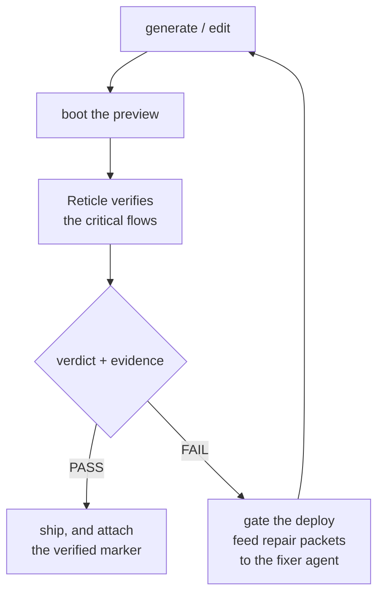

Two ways in. **A team** runs `npx @reticlehq/server init` once and points its coding agent at the MCP server. **A platform** adds the dev-only SDK to its generated-app template, runs `npx @reticlehq/server serve --http --drive <preview-url>` beside each preview, and `POST`s to `/verify` after every generate or edit, gating the ship on `run.verdict.status === 'pass'` and feeding `run.repair.failurePackets[]` back to a fixer agent.

> The one guide for adopting Reticle, both for a team using a coding agent on its own app and for an AI app-builder platform (Lovable / Emergent / Bolt) embedding Reticle in its generation pipeline. Reticle reads the program from _inside_ a running app and returns a **verdict with evidence** ("did it actually work?"), not a screenshot. Enterprise/premium access lives in [`enterprise.md`](./enterprise.md).

## The loop



One call replays the app's key journeys and asserts **program truth** (network cardinality, store/state, emitted signals, console), then returns a deterministic, un-hallucinatable verdict.

---

## Quickstart

### A. A team, agent on your own app (~10 min)

```bash
npx @reticlehq/server init   # auto-detects your framework, installs the kit + build plugin
```

Paste to your agent (Claude Code / Cursor / any MCP agent): `Follow https://raw.githubusercontent.com/reticlehq/reticle/main/SKILL.md` It runs the wizard once (Vite/Next plugin + SDK init + MCP config), then verifies on every change. Run your dev server, then ask the agent to _"verify it with Reticle."_

### B. A platform / CI, driven from your pipeline (no MCP, no human)

```bash
npx @reticlehq/server serve --http --http-token "$TOKEN" --drive "$PREVIEW_URL"   # localhost:7331
```

```js
const { run } = await (
  await fetch('http://127.0.0.1:7331/verify', {
    method: 'POST',
    headers: { 'content-type': 'application/json', 'x-reticle-token': process.env.TOKEN },
    body: JSON.stringify({
      project: { name, framework, previewUrl },
      trigger: { kind: 'oem', diffRef },
    }),
  })
).json();

if (run.verdict.status !== 'pass') {
  for (const p of run.repair?.failurePackets ?? []) fixerAgent.send(p.suggestedPrompt); // self-heal
  blockDeploy(run);
} else attachToDeploy(run); // "verified ✓"; set profile:"prod-preview" to redact internals downstream
```

Or skip the HTTP server entirely with the one-shot CLI: `reticle verify <preview-url>` drives the preview, replays the saved flows, prints the verdict, and exits non-zero on fail (ideal for a CI step).

---

## In-app SDK integration: the effort, by layer

Reticle embeds a **dev/preview-only** SDK (`@reticlehq/browser`, Apache-2.0, tree-shaken from production). For a platform you add this **once to your generated-app template** → every generated app is verifiable.

| Layer | What you add | Unlocks | Effort |
| --- | --- | --- | --- |
| **1: drive + DOM/network/console** | 1 build-plugin line + ~10-line dev-only `reticle.connect({…})` file (`npx @reticlehq/server init` does it) | broken routes, network status/cardinality (double-submit), console errors, persistence-after-reload | **Easy** (~15 min) |
| **2: program-state truth** | `registerStore('app', store)` (1/store, pass the store itself so mutations emit diffs) + `reticle.signal('order:saved', …)` (1/consequence) + `data-testid`s | UI-vs-store desync, dead handlers, blast-radius, source mapping | **Easy to Medium** (an afternoon, once) |
| **3: governance (optional)** | `registerCapabilities(...)` (signals/stores/risk zones) + recorded flows with success oracles | risk policy + sharper verdicts | **Medium**, optional |

Copyable patterns: `apps/bench-app/src/reticle-dev.ts`, `apps/next-smoke/app/reticle-dev.tsx`. Without instrumentation, Layer-1 checks still work via the driven browser; Layers 2 and 3 are what no out-of-page tool can see.

---

## What it catches that a screenshot can't

| Silent failure (a generated app ships it) | How Reticle catches it |
| --- | --- |
| Mock data (POST 200, row shows, nothing persists) | persistence/`state` oracle (doesn't survive reload) |
| Dead handler (looks done, store never changed) | `state` desync |
| Double-submit (one click, two POSTs) | `net { count: 1 }` |
| Forbidden call (a must-never-fire endpoint fired) | `net { count: 0 }` |
| Missing validation (`"abc"` becomes data) | flow oracle (error shown AND nothing created) |
| Silent console error (logged, UI still renders) | `console { absent: true }` |
| UI-vs-store desync (the total lies) | reads the store, contradicts the display |
| Blast-radius (an action corrupts unrelated state) | `state { hold:true }` invariant |

Live, clickable demo of each: `apps/vibe-builder-demo/` (set `BUG_MODE=…`). Proven in CI: `packages/server/src/runs/generated-app-bugs.test.ts`.

---

## The minimal attach contract (for a harness or MCP host)

Reticle is a stdio MCP server. A host that wires it correctly does four things, and each one is a step Reticle can see:

1. **Spawn it.** `npx @reticlehq/server mcp`, over stdio, one process per host. That process is the proxy: it starts the local daemon on demand, reconnects on its own when the stream drops, and answers from cache while a daemon comes back.
2. **Complete `initialize`.** Reticle answers the handshake itself when the daemon is slow, so a host that waits for a reply gets one either way.
3. **Send `tools/list`, and send it again on `notifications/tools/list_changed`.** This is the step hosts skip. Registering a server is not the same as enumerating it: a host can register Reticle and never ask for the tool list until the client is restarted, and the model then has no Reticle tools at all while the install looks healthy from every other angle. Reticle declares `tools.listChanged` so a host that honours the notification recovers without a restart.
4. **Call the tools.** `tools/call`, with the tool name and its arguments.

`reticle status` reports how far a host has got. `mcpClient: "never-attached"` means no client has started the server on this port. `mcpClient: "never-enumerated"` means one started it and never asked for the tool list, which is the state a client restart fixes. `mcpClient: "enumerated"` means the client side is done, and anything still missing is the app rather than the host. The record is per port rather than per client, and it begins the first time a client starts a Reticle version that keeps it, so `status` says both of those out loud instead of naming a client it cannot see.

### Hosts that cap the number of tools

Some editors cap the total tool count across every MCP server, which is why Reticle advertises a small surface instead of everything it can do. Nothing is out of reach: `reticle_tools { names: [...] }` lists the tools and returns the full argument grammar for the ones you name, and `reticle_run { tool, args }` invokes any of them, advertised or not. A host that is short on tool slots pays for the advertised handful and still reaches the whole surface through that pair. See [`reticle_tools` and `reticle_run`](/tools-tools-and-run).

---

## Exact steps per platform

The shape is identical (in-app SDK in the template → verify in the sandbox → act on the verdict); the specifics differ by where each platform runs the preview.

### Emergent (Kubernetes pod per build, reverse-proxied preview URL)

1. Add `@reticlehq/browser` + `registerStore`/`reticle.signal` to the generated-app **scaffold** (one time).
2. In the build pod, alongside the preview: `reticle serve --http --http-token "$POD_TOKEN" --drive "$PREVIEW_URL"` (or import `ReticleRunner` in-process).
3. In the orchestrator's generate→test→iterate loop, `POST /verify` after the preview boots.
4. FAIL → route `repair.failurePackets[].suggestedPrompt` to the fixer subagent → re-verify (closes the loop). PASS → publish + attach the `prod-preview` run as the user-facing "verified ✓".

### Lovable (Vite/React generated apps, hosted preview)

1. Add the Reticle Vite plugin + dev-only `reticle.connect` to the project template (Lovable already templates Vite/React, so it's one plugin line + the connect file).
2. Run `npx @reticlehq/server serve --http --drive <preview-url>` against the preview build in the generation worker.
3. Call `/verify` after each generate/edit; gate the "your app is ready" signal on `verdict.status === 'pass'`; feed repair packets back into the edit agent.

### Bolt.new / StackBlitz (WebContainer, in-browser runtime)

1. Add the SDK to the WebContainer app template; the app + Reticle bridge run in the WebContainer.
2. Since the runtime is in-browser, drive via the connected session (the SDK dials the bridge) rather than `--drive`; call verify from the Bolt agent after a build.
3. Same act-on-verdict: gate + self-heal with the repair packets. (Bolt already detects terminal/compile errors; Reticle adds the _runtime program-truth_ layer it's blind to.)

> Honest note: a platform can build a verification step itself. Reticle's case is the depth (program-state and source mapping), the determinism (0% flake, no LLM in the loop), the un-hallucinatable verdict, and a stable drop-in artifact. The reproducible benchmark in [`bench/`](../bench/README.md) measures the observation-cost and detection differences against other browser-automation MCPs.

---

## The verdict artifact

`POST /verify` (and `reticle_run_export`) return a stable, versioned `ReticleVerificationRun` (defined in `@reticlehq/core`): `verdict` (pass/fail/partial, confidence, blockingRisks), `flows[]`, `checks[]`, `risks[]` (auth/payment/db/…), `repair.failurePackets[]` (what + where to fix), `evidence`. Render a legible report with `renderRunReport()` or `reticle_run_export { format: "report" }`. Profiles: `dev` (full) vs `prod-preview` (source + state redacted for downstream sharing).

**Why trust it:** the verdict is mechanical, derived only from observed outcomes, so it can't report green for something it never ran (a severed backend reads as _fail_, never a confident pass). Proof: `packages/server/src/runs/false-green.test.ts`.

## Licensing for embedding

The embeddable SDK is **Apache-2.0** (ship it in your customers' apps). The server/CLI is **FSL** (free, no competing resale). Enterprise features + the premium-access flow: [`enterprise.md`](./enterprise.md). OEM terms: **[hey@reticle.sh](mailto:hey@reticle.sh)**.
