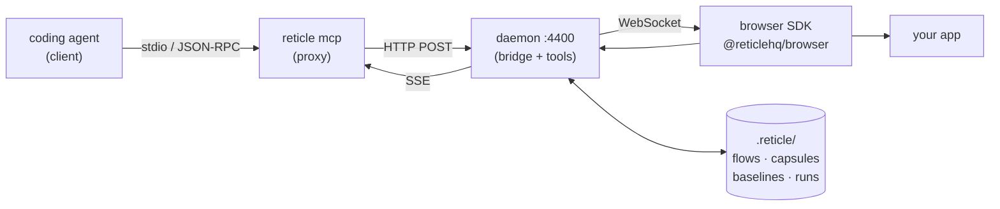

A tool call crosses five processes and four hops: coding agent → `reticle mcp` proxy (stdio) → daemon on `:4400` (HTTP POST out, SSE back) → browser SDK (WebSocket) → your app. Each hop has its own failure vocabulary and its own way of lying, and the ones marked **silent** below fail with no error reaching either the agent or you.

> How a tool call gets from a coding agent to your app and back, what each hop can do wrong, and which of those failures are **silent**. Written for anyone touching the transport, the daemon, the bridge, or a gate, and for contributors trying to work out where their change lives.
>
> Companion pages: [`harness-rules.md`](../apps/e2e/harness-rules.md) (what a gate must do about all this) and [`telemetry-contract.md`](./telemetry-contract.md) (the rules for anything that emits).

## 1. Topology: 5 processes, 4 hops

Each hop has its own failure vocabulary, its own recovery, and its own way of lying. Nothing stated this end to end until this page, which is why gate results have been contradictory.

## 2. Connection establishment

| # | Step | Owner | Fails how |
| --- | --- | --- | --- |
| 1 | client spawns `reticle mcp` over stdio | client | the client's own startup timeout; **no host respawns a dead stdio server** |
| 2 | proxy probes `:4400` (`probeDaemon`, plain TCP, 500ms) | proxy | a squatter that accepts and never serves looks alive |
| 3 | absent → spawn daemon detached, poll to `DAEMON_READY_TIMEOUT_MS` (10s) | proxy | slow CI; raise with `RETICLE_DAEMON_READY_TIMEOUT_MS` |
| 4 | proxy opens SSE, waits for the `endpoint` frame → POST URL | proxy | an empty frame used to read as "connected"; now refused (`buildSessionUrl`) |
| 5 | `initialize`, answered **locally** after `LOCAL_HANDSHAKE_MS` (12s) when the daemon cannot | proxy | any client with a startup budget under ~12s loses Reticle for the whole session |
| 6 | daemon binds `:4400`, writes the pid file, starts bridge + idle watcher | daemon | `EADDRINUSE` → child exits 1, **parent already exited 0** |
| 7 | app calls `reticle.connect()` → `ws://localhost:4400/reticle` | SDK | wrong port; missing pairing token; mixed content (Safari throws synchronously on `new WebSocket`) |
| 8 | HELLO: `sessionId`, `projectId`, `protocolVersion`, capabilities | SDK → bridge | version mismatch → `1008` close → **the SDK stops retrying, permanently** |
| 9 | bridge authenticates: pairing token / loopback tier / Origin allow-list | bridge | another project's daemon answers → `authFailureReason` names it |
| 10 | Session registered, `everConnected = true` | daemon | n/a |
| 11 | tool call → `runTool` → `session.send` → WS command → SDK → reply | all | any hop above, mid-flight |

**Sequencing hazard:** steps 6 and 7 race. The product absorbs it internally (the first live tool call blocks briefly for a session to appear rather than failing), but a gate that boots an app and immediately asks whether a session exists is outside that protection and has been burned by it. Poll for the session; never sample once.

## 3. The tool graph: what produces what

Three different counts, all measured, and the difference between them matters:

| Count | What it is |
| --- | --- |
| **68** | name constants in `ReticleTool` |
| **48** | tools advertised under `RETICLE_ADVERTISE_ALL_TOOLS=1`, i.e. what `tool-surface-sweep-test` drives (51 calls) |
| **19** | advertised by default; the rest are reached through `reticle_run` |

68 → 48 is **family folding**: `reticle_baseline`, `reticle_session`, `reticle_record`, `reticle_flow` and `reticle_lease` each absorb their members behind an `action` parameter. So "every tool is callable" is asserted over 48 surfaces, not 68 behaviours; a family member reachable only through an `action` value the sweep never passes is not covered by it. Worth closing when the per-tool budget lands (see [`gate-plan.md`](./gate-plan.md), Phase 4).

| Token | Produced by | Consumed by | Invalidated by |
| --- | --- | --- | --- |
| `sessionId` | `reticle_sessions`, HELLO | ~every tool | tab close; **survives reload** via `sessionStorage` |
| `ref` (`e115`) | `snapshot`, `query`, `scroll_to` | `inspect`, `act`, `act_and_wait`, `state` | any re-render; refuses cleanly rather than clicking the new occupant |
| `actionId` (`a2`) | `act`, `act_and_wait` | `observe`, `network`, `console` filters | window expiry |
| `since` cursor | every read | every read | ring-buffer eviction |
| `capsuleSaved` | `act_and_wait` | `replay` | n/a |
| flow | `record_start` → acts → `flow_save_recorded` | `flow_verify`, `flow_replay`, `flow_heal`, `affected`, `gate` | DOM drift → `flow_heal` |
| baseline | `baseline_save`, `viewport` | `visual_diff`, `diff` | viewport change |
| `session_lease` | direct tool results | the agent (`yield` / `end`) | **dropped on the `reticle_run` path** (#119) |
| run artifact | `run_export`, `reticle verify` | CI, `reticle gate` | n/a |

Two structural facts:

- **`reticle_run` is a second dispatch path.** It routes through `runTool`, so telemetry is intact, but anything decorating results _above_ `runTool` silently does not apply. The session lease is the instance we know about; the next decorator inherits the same bug.
- **`record → save → verify → heal` is the only model-free loop**, and it is what makes a cheap gate possible at all.

## 4. Fragility inventory

**Silent** = fails with no error surfaced to the agent or the user.

### Hop 1: client ↔ proxy

| Failure | Silent | Guarded by |
| --- | --- | --- |
| proxy killed externally (the `lsof -ti` recipe) | **yes, total** | `reticle kill` frees the port and leaves the agent's own proxy alone. See [harness rule 1](../apps/e2e/harness-rules.md) |
| proxy uncaught exception | no | `installProxyResilience` + `proxyLog` |
| proxy exits when the reconnect budget is spent | _was the worst bug in the product_ | `onReconnectBudgetSpent` → DORMANT, never exit |
| client closes stdin with calls in flight | no | `SHUTDOWN_DRAIN_MS` (5s) |

### Hop 2: proxy ↔ daemon

Three distinct populations of unanswered call, **all covered**:

| Population                                    | Answered by                        |
| --------------------------------------------- | ---------------------------------- |
| forwarded, then the SSE stream dropped        | `streamLossReplies` → `-32001`     |
| queued while dormant/reconnecting, never sent | `QUEUE_WAIT_MS` (20s) → `-32001`   |
| POST-leg `ECONNRESET` while SSE is healthy    | `postToSession` returns the reason |

Still fragile:

| Failure | Silent | Note |
| --- | --- | --- |
| squatter on `:4400` | partly | 12s handshake, then the first tool call diagnoses it |
| stale tool catalog served while dormant | **yes** | `ToolCatalogCache` answers `tools/list` from cache; after a version change a client can hold a catalog the daemon no longer implements |
| handshake replay regresses | **yes** | the daemon builds a fresh `McpServer` per SSE connection, so every `tools/call` would hit an uninitialized server |

### Hop 3: daemon lifecycle

| Failure | Silent | Note |
| --- | --- | --- |
| `serve` exits 0 on `EADDRINUSE` | **yes** | #115: the parent reports the spawn, the child reports the bind, nothing joins them |
| liveness is the pid file, never the port | **yes** | `daemon/daemon.ts:156` |
| idle shutdown fires mid-install | **yes** | 5min base / 30min attached; already scored three fixtures as install failures |
| `isUselessDaemon` ends a daemon that served nothing | **yes** | lifetime facts, but a gate that installs for six minutes before its first call is that daemon |
| a daemon spawned inside a tool call is reaped when the call ends | **yes** | `SIGTERM` within ~1s, `detached` or not |
| no `daemon_alive` heartbeat | **fixed** | a killed daemon and a tidy exit used to read identically; the daemon now beats every 30s and `classifyDaemonLife` turns silence into `died_silently` (#123) |
| no port arbitration | **yes** | a second daemon can bind a port a first one held |

### Hop 4: bridge ↔ SDK

| Failure | Silent | Note |
| --- | --- | --- |
| protocol mismatch → `1008` | no, but **terminal** | the SDK stops retrying by design; the app is dark until reload (#127) |
| another project's daemon answers | no | `authFailureReason` is evidence-based, only claiming it when the daemon has demonstrably served another project |
| `rejectAll('session disconnected')` | **fixed** | used to become `verified:"no" / assertion_failed`, i.e. Reticle blaming the app, by file and line, for its own lost connection. Now `verified:"unknown" / observation_lost` (#124) |
| reaper ends a quiet session | no | revivable on the agent's next action |
| opaque origins (`tauri://localhost`, `file://`) | no | kept verbatim in the allow-list rather than collapsed to `"null"` |

### Hop 5: SDK internals

| Failure | Silent | Note |
| --- | --- | --- |
| fixed 1s reconnect, no backoff, unbounded | **yes** | and the noise lands in the console channel we report to the agent (#116) |
| `onUnreachable` suppressed after the first success | **yes** | a **mid-session** outage never warns at all |
| offline queue overflow (`MAX_QUEUE = 500`) | no | gap marker stamped at the **oldest** drop, the honest floor for where the hole starts |
| `sessionStorage` throws in a sandboxed iframe | no | falls back; a session must still start |

## 5. Where the gates are

| Layer | Class | Covered by | Gap |
| --- | --- | --- | --- |
| stdio | proxy survival | `mcp-survives-test` | external SIGKILL |
| SSE/POST | unanswered calls | `mcp-stress-test` | fault injection is `kill -9`, not specified toxics |
| daemon | lifecycle, idle, port | `daemon-lifecycle-test`, `status-honesty-test` | port arbitration, heartbeat |
| bridge | auth, origins, version | `version-skew-test` | desktop origins under install |
| SDK | queue, gaps, reconnect | browser unit tests | mid-session outage → verdict |
| tools | surface, schema, refusals | `tool-surface-sweep-test`, `tool-fuzz-test` | latency/failure budget |
| verdict | honesty | `release-smoke-test` | transport ≠ app (#124); false-green rate |
| telemetry | silent absence | `telemetry-events-test`, `telemetry-contract.test.ts` | chokepoint coverage |
| install | pristine-surface wiring | nothing | the whole class |
| client | per-agent MCP compatibility | nothing | the whole class |

Nine of eleven layers have a gate. The two that do not are exactly the two that need a second repo and a human. The plan for both is in [`gate-plan.md`](./gate-plan.md).

## 6. Traces already encode the invariants

`runTool` opens one `tool.handler` root span per call and every stage underneath inherits it. With `RETICLE_TRACE=1` that makes three assertions available from any existing battery run, at the cost of one log parser:

- exactly one root span at `depth: 0` per tool call
- **zero orphan spans**; 23 orphans on one healthy run is the documented signature of a hung call
- `settleTiming` always fires; it sits in a `finally` so a thrown call cannot leak a concurrency slot

Today that output is produced and discarded.
